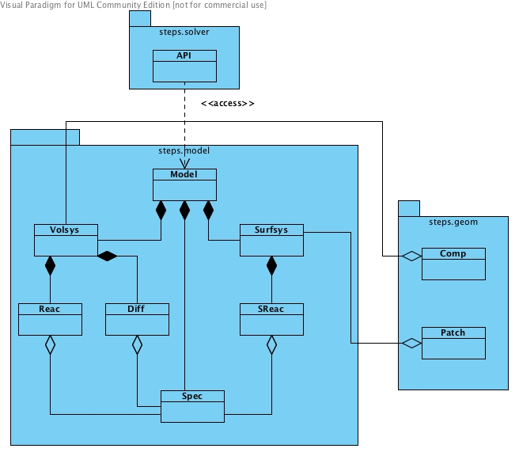

.. _API_1_model:

*****************
steps.API_1.model
*****************

Namespace for objects of species, reactions and diffusions, 
as well as their containers.
   

   
   Class diagram for steps.API_1.model namespace.
   
* :class:`steps.API_1.model.Model`
* :class:`steps.API_1.model.Spec`
* :class:`steps.API_1.model.Volsys`
* :class:`steps.API_1.model.Surfsys`
* :class:`steps.API_1.model.Reac`
* :class:`steps.API_1.model.SReac`
* :class:`steps.API_1.model.Diff`
* :class:`steps.API_1.model.Chan`
* :class:`steps.API_1.model.ChanState`
* :class:`steps.API_1.model.GHKcurr`
* :class:`steps.API_1.model.OhmicCurr`
* :class:`steps.API_1.model.VDepSReac`

.. automodule:: steps.API_1.model

.. autoclass:: steps.API_1.model.Model
   :members:
   :undoc-members:
   :inherited-members:
   
.. autoclass:: steps.API_1.model.Spec
   :members:
   :undoc-members:
   :inherited-members:
   
.. autoclass:: steps.API_1.model.Volsys
   :members:
   :undoc-members:
   :inherited-members:
   
.. autoclass:: steps.API_1.model.Surfsys
   :members:
   :undoc-members:
   :inherited-members:
   
.. autoclass:: steps.API_1.model.Reac
   :members:
   :undoc-members:
   :inherited-members:
   
.. autoclass:: steps.API_1.model.SReac
   :members:
   :undoc-members:
   :inherited-members:
   
.. autoclass:: steps.API_1.model.Diff
   :members:
   :undoc-members:
   :inherited-members:

.. autoclass:: steps.API_1.model.Chan
   :members:
   :undoc-members:
   :inherited-members:

.. autoclass:: steps.API_1.model.ChanState
   :members:
   :undoc-members:
   :inherited-members:

.. autoclass:: steps.API_1.model.GHKcurr
   :members:
   :undoc-members:
   :inherited-members:

.. autoclass:: steps.API_1.model.OhmicCurr
   :members:
   :undoc-members:
   :inherited-members:

.. autoclass:: steps.API_1.model.VDepSReac
   :members:
   :undoc-members:
   :inherited-members:
