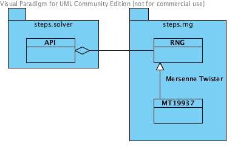

.. _API_1_rng:

***************
steps.API_1.rng
***************

Namespace for random number generator classes.

   
   Class diagram for steps.API_1.rng namespace.
   
.. automodule:: steps.API_1.rng

.. autofunction:: steps.API_1.rng.create

.. autofunction:: steps.API_1.rng.create_mt19937

.. autoclass:: steps.API_1.rng.RNG
   :members: initialize
