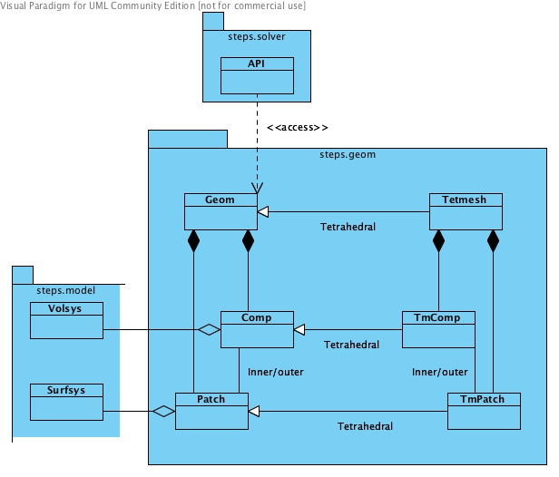

.. _API_geom:

***********
steps.geom
***********

Namespace for geometry objects.

   

   
   Class diagram for steps.geom namespace.
   
* :class:`steps.geom.Geom`
* :class:`steps.geom.Comp`
* :class:`steps.geom.Patch`
* :class:`steps.geom.Tetmesh`
* :class:`steps.geom.TmComp`
* :class:`steps.geom.TmPatch`
* :class:`steps.geom.DiffBoundary`
* :class:`steps.geom.SDiffBoundary`
* :class:`steps.geom.Memb`

.. automodule:: steps.geom

.. autoclass:: steps.geom.Geom
   :members:
   :undoc-members:
   :inherited-members:
   
.. autoclass:: steps.geom.Comp
   :members:
   :undoc-members:
   :inherited-members:
   
.. autoclass:: steps.geom.Patch
   :members:
   :undoc-members:
   :inherited-members:
   
.. autoclass:: steps.geom.Tetmesh
   :members:
   :undoc-members:
   :inherited-members:
   
.. autoclass:: steps.geom.TmComp
   :members:
   :undoc-members:
   :inherited-members:
   
.. autoclass:: steps.geom.TmPatch
   :members:
   :undoc-members:
   :inherited-members:

.. autoclass:: steps.geom.DiffBoundary
   :members:
   :undoc-members:
   :inherited-members:

.. autoclass:: steps.geom.SDiffBoundary
   :members:
   :undoc-members:
   :inherited-members:

.. autoclass:: steps.geom.Memb
   :members:
   :undoc-members:
   :inherited-members:

