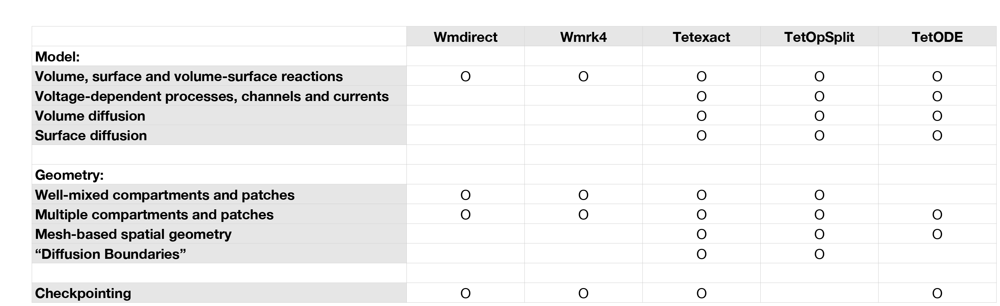

.. _API_solver:

************
steps.solver
************

.. module:: steps.solver

Implementation of serial simulation solvers. 

   
   Class diagram for steps.solver namespace.
   
* :class:`steps.solver.Wmrk4`
* :class:`steps.solver.Wmdirect`
* :class:`steps.solver.Tetexact`
* :class:`steps.solver.TetODE`

Each solver is a partial or full implementation of the STEPS solver API.
At the moment STEPS implements four different serial solvers (and one parallel solver in steps.mpi.solver namespace). 

:class:`steps.solver.Wmrk4` implements a well-mixed, deterministic solver 
based on the Runge–Kutta method. 

:class:`steps.solver.Wmdirect` implements a stochastic, well-mixed solver 
based on Gillespie's Direct SSA Method. 

:class:`steps.solver.Tetexact` implements a stochastic reaction-diffusion 
solver, based on Gillespie's Direct SSA Method extended for diffusive fluxes 
between tetrahedral elements in complex geometries.

:class:`steps.solver.TetODE` is a spatial determinstic solver where diffusive fluxes are
between tetrahedral elements in complex geometries. Uses CVODE for solutions.

While each unique solver applies a different method for simulation to the other 
solvers, each solver also typically supports a different subset of all the features in :ref:`API_model` and :ref:`API_geom` 
components, where some features are unimplemented because they don’t make sense for the solver or 
simply because the solver is not yet fully mature. For example, the exclusively well-mixed solvers, 
Wmdirect and Wmrk4, do not support mesh-based spatial simulations so ignore diffusion rules. When a user attempts to invoke an 
unimplemented feature on a solver, the feature may simply be ignored (for example a 
Wmdirect solver object can be created with a mesh-based geometry, but the solver will simply ignore the 
spatial information and extract only the compartment volumes, patch areas and connectivity) or it may 
result in a simulation error. Such behaviours are described in more detail in the relevant sections. 
The following table gives a visual guide to the supported features for each solver: 
 

   
   At-a-glance guide of supported features by solver.

.. autoclass:: Wmrk4

    **Solver Information**
    
    .. automethod:: getSolverName
    .. automethod:: getSolverDesc
    .. automethod:: getSolverAuthors
    .. automethod:: getSolverEmail
    
    **Solver Control**
    
    .. automethod:: reset
    .. automethod:: checkpoint
    .. automethod:: restore
    .. automethod:: run
    .. automethod:: advance
    .. automethod:: step
    .. automethod:: setDT
    .. automethod:: setRk4DT
    .. automethod:: getRk4DT
    .. automethod:: getTime
    
    **Compartment Data Access**
    
    .. automethod:: getCompVol
    .. automethod:: setCompVol
    .. automethod:: getCompCount
    .. automethod:: setCompCount
    .. automethod:: getCompAmount
    .. automethod:: setCompAmount
    .. automethod:: getCompConc
    .. automethod:: setCompConc
    .. automethod:: getCompClamped
    .. automethod:: setCompClamped 
    .. automethod:: getCompReacK 
    .. automethod:: setCompReacK
    .. automethod:: getCompReacActive
    .. automethod:: setCompReacActive
        
    **Patch Data Access**
    
    .. automethod:: getPatchArea
    .. automethod:: setPatchArea
    .. automethod:: getPatchCount
    .. automethod:: setPatchCount
    .. automethod:: getPatchAmount
    .. automethod:: setPatchAmount
    .. automethod:: getPatchClamped
    .. automethod:: setPatchClamped
    .. automethod:: getPatchSReacK
    .. automethod:: setPatchSReacK
    .. automethod:: getPatchSReacActive
    .. automethod:: setPatchSReacActive
    
.. autoclass:: Wmdirect

    **Solver Information**
    
    .. automethod:: getSolverName
    .. automethod:: getSolverDesc
    .. automethod:: getSolverAuthors
    .. automethod:: getSolverEmail
    
    **Solver Control**
    
    .. automethod:: reset
    .. automethod:: checkpoint
    .. automethod:: restore
    .. automethod:: run
    .. automethod:: advance
    .. automethod:: step
    .. automethod:: getTime
    .. automethod:: getA0
    .. automethod:: getNSteps
    
    **Compartment Data Access**
    
    .. automethod:: getCompVol
    .. automethod:: setCompVol
    .. automethod:: getCompCount
    .. automethod:: setCompCount
    .. automethod:: getCompAmount
    .. automethod:: setCompAmount
    .. automethod:: getCompConc
    .. automethod:: setCompConc
    .. automethod:: getCompClamped
    .. automethod:: setCompClamped 
    .. automethod:: getCompReacK 
    .. automethod:: setCompReacK
    .. automethod:: getCompReacActive
    .. automethod:: setCompReacActive
    .. automethod:: getCompReacC
    .. automethod:: getCompReacH
    .. automethod:: getCompReacA
    .. automethod:: getCompReacExtent
    .. automethod:: resetCompReacExtent
        
    **Patch Data Access**
    
    .. automethod:: getPatchArea
    .. automethod:: setPatchArea
    .. automethod:: getPatchCount
    .. automethod:: setPatchCount
    .. automethod:: getPatchAmount
    .. automethod:: setPatchAmount
    .. automethod:: getPatchClamped
    .. automethod:: setPatchClamped
    .. automethod:: getPatchSReacK
    .. automethod:: setPatchSReacK
    .. automethod:: getPatchSReacActive
    .. automethod:: setPatchSReacActive
    .. automethod:: getPatchSReacC
    .. automethod:: getPatchSReacH
    .. automethod:: getPatchSReacA
    .. automethod:: getPatchSReacExtent
    .. automethod:: resetPatchSReacExtent
    
.. autoclass:: Tetexact

    **Solver Information**
    
    .. automethod:: getSolverName
    .. automethod:: getSolverDesc
    .. automethod:: getSolverAuthors
    .. automethod:: getSolverEmail
    
    **Solver Control**
    
    .. automethod:: reset
    .. automethod:: checkpoint
    .. automethod:: restore
    .. automethod:: run
    .. automethod:: advance
    .. automethod:: step
    .. automethod:: getTime
    .. automethod:: getA0
    .. automethod:: getNSteps
    .. automethod:: getTemp
    .. automethod:: setTemp
    .. automethod:: setEfieldDT

    
    **Compartment Data Access**
    
    .. automethod:: getCompVol
    .. automethod:: getCompCount
    .. automethod:: setCompCount
    .. automethod:: getCompAmount
    .. automethod:: setCompAmount
    .. automethod:: getCompConc
    .. automethod:: setCompConc
    .. automethod:: getCompClamped
    .. automethod:: setCompClamped 
    .. automethod:: getCompReacK 
    .. automethod:: setCompReacK
    .. automethod:: getCompReacActive
    .. automethod:: setCompReacActive
    .. automethod:: getCompDiffD
    .. automethod:: setCompDiffD
    .. automethod:: getCompDiffActive
    .. automethod:: setCompDiffActive
    .. automethod:: getCompReacC
    .. automethod:: getCompReacH
    .. automethod:: getCompReacA
    .. automethod:: getCompReacExtent
    .. automethod:: resetCompReacExtent
    
    **Patch Data Access**
    
    .. automethod:: getPatchArea
    .. automethod:: getPatchCount
    .. automethod:: setPatchCount
    .. automethod:: getPatchAmount
    .. automethod:: setPatchAmount
    .. automethod:: getPatchClamped
    .. automethod:: setPatchClamped
    .. automethod:: getPatchSReacK
    .. automethod:: setPatchSReacK
    .. automethod:: getPatchSReacActive
    .. automethod:: setPatchSReacActive
    .. automethod:: getPatchSReacC
    .. automethod:: getPatchSReacH
    .. automethod:: getPatchSReacA
    .. automethod:: getPatchSReacExtent
    .. automethod:: resetPatchSReacExtent
    .. automethod:: getPatchVDepSReacActive
    .. automethod:: setPatchVDepSReacActive

    **Diffusion Boundary Data Access**
    
    .. automethod:: setDiffBoundaryDiffusionActive
    .. automethod:: getDiffBoundaryDiffusionActive
    .. automethod:: setDiffBoundaryDcst

    **Surface Diffusion Boundary Data Access**
    
    .. automethod:: setSDiffBoundaryDiffusionActive
    .. automethod:: getSDiffBoundaryDiffusionActive
    .. automethod:: setSDiffBoundaryDcst

    **Tetrahedral Data Access**
    
    .. automethod:: getTetVol
    .. automethod:: getTetSpecDefined
    .. automethod:: getTetCount
    .. automethod:: setTetCount
    .. automethod:: getTetAmount
    .. automethod:: setTetAmount
    .. automethod:: getTetConc
    .. automethod:: setTetConc
    .. automethod:: getTetClamped
    .. automethod:: setTetClamped
    .. automethod:: getTetReacK
    .. automethod:: setTetReacK
    .. automethod:: getTetReacActive
    .. automethod:: setTetReacActive
    .. automethod:: getTetDiffD
    .. automethod:: setTetDiffD
    .. automethod:: getTetDiffActive
    .. automethod:: setTetDiffActive
    .. automethod:: getTetReacC
    .. automethod:: getTetReacH
    .. automethod:: getTetReacA
    .. automethod:: getTetDiffA
    .. automethod:: getTetV
    .. automethod:: setTetV
    .. automethod:: getTetVClamped
    .. automethod:: setTetVClamped
    
    **Triangular Data Access**
    
    .. automethod:: getTriArea
    .. automethod:: getTriSpecDefined
    .. automethod:: getTriCount
    .. automethod:: setTriCount
    .. automethod:: getTriAmount
    .. automethod:: setTriAmount
    .. automethod:: getTriClamped
    .. automethod:: setTriClamped
    .. automethod:: getTriSReacK
    .. automethod:: setTriSReacK
    .. automethod:: getTriSReacActive
    .. automethod:: setTriSReacActive
    .. automethod:: getTriSReacC
    .. automethod:: getTriSReacH
    .. automethod:: getTriSReacA
    .. automethod:: getTriSDiffD
    .. automethod:: setTriSDiffD
    .. automethod:: getTriV
    .. automethod:: setTriV
    .. automethod:: getTriVClamped
    .. automethod:: setTriVClamped
    .. automethod:: getTriOhmicI
    .. automethod:: getTriGHKI
    .. automethod:: getTriI
    .. automethod:: setTriIClamp
    .. automethod:: getTriVDepSReacActive
    .. automethod:: setTriVDepSReacActive

    **Vertex Data Access**
    
    .. automethod:: getVertV
    .. automethod:: setVertV
    .. automethod:: getVertVClamped
    .. automethod:: setVertVClamped
    .. automethod:: setVertIClamp

    **Membrane Data Access**
    
    .. automethod:: saveMembOpt
    .. automethod:: setMembPotential
    .. automethod:: setMembCapac
    .. automethod:: setMembVolRes
    .. automethod:: setMembRes
    
    **Batch Data Access**
    
    .. automethod:: getBatchTetCounts
    .. automethod:: getBatchTriCounts
    .. automethod:: getBatchTetCountsNP
    .. automethod:: getBatchTriCountsNP

    **Region of Interest functions**
    
    .. automethod:: getROITetCounts
    .. automethod:: getROITriCounts
    .. automethod:: getROITetCountsNP
    .. automethod:: getROITriCountsNP
    .. automethod:: getROIVol
    .. automethod:: getROIArea
    .. automethod:: getROICount
    .. automethod:: setROICount
    .. automethod:: getROIAmount
    .. automethod:: getROIConc
    .. automethod:: setROIClamped
    .. automethod:: setROIReacK
    .. automethod:: setROISReacK
    .. automethod:: setROIDiffD
    .. automethod:: setROIReacActive
    .. automethod:: setROISReacActive
    .. automethod:: setROIDiffActive
    .. automethod:: setROIVDepSReacActive
    .. automethod:: getROIReacExtent
    .. automethod:: resetROIReacExtent
    .. automethod:: getROISReacExtent
    .. automethod:: resetROISReacExtent
    .. automethod:: getROIDiffExtent
    .. automethod:: resetROIDiffExtent

.. autoclass:: TetODE

    **Solver Information**

    .. automethod:: getSolverName
    .. automethod:: getSolverDesc
    .. automethod:: getSolverAuthors
    .. automethod:: getSolverEmail

    **Solver Control**

    .. automethod:: checkpoint
    .. automethod:: restore
    .. automethod:: reset
    .. automethod:: getTime
    .. automethod:: run
    .. automethod:: advance
    .. automethod:: getTemp
    .. automethod:: setTemp

    **Compartment Data Access**

    .. automethod:: getCompCount
    .. automethod:: setCompCount
    .. automethod:: getCompVol
    .. automethod:: getCompAmount
    .. automethod:: setCompAmount
    .. automethod:: getCompConc
    .. automethod:: setCompConc
    .. automethod:: setCompReacK

    **Patch Data Access**

    .. automethod:: getPatchCount
    .. automethod:: setPatchCount
    .. automethod:: getPatchArea
    .. automethod:: getPatchAmount
    .. automethod:: setPatchAmount
    .. automethod:: setPatchSReacK

    **Tetrahedral Data Access**

    .. automethod:: getTetVol
    .. automethod:: getTetCount
    .. automethod:: setTetCount
    .. automethod:: getTetAmount
    .. automethod:: setTetAmount
    .. automethod:: getTetConc
    .. automethod:: setTetConc
    .. automethod:: setTetReacK
    .. automethod:: getTetV
    .. automethod:: setTetV
    .. automethod:: getTetVClamped
    .. automethod:: setTetVClamped

    **Triangular Data Access**

    .. automethod:: getTriArea
    .. automethod:: getTriCount
    .. automethod:: setTriCount
    .. automethod:: getTriAmount
    .. automethod:: setTriAmount
    .. automethod:: setTriSReacK

    .. automethod:: getTriV
    .. automethod:: setTriV
    .. automethod:: getTriVClamped
    .. automethod:: setTriVClamped
    .. automethod:: setTriIClamp
    .. automethod:: getTriI

    **Vertex Data Access**
    
    .. automethod:: getVertV
    .. automethod:: setVertV
    .. automethod:: getVertVClamped
    .. automethod:: setVertVClamped
    .. automethod:: setVertIClamp

    **Membrane Data Access**
    
    .. automethod:: setMembPotential
    .. automethod:: setMembCapac
    .. automethod:: setMembVolRes
    .. automethod:: setMembRes

    **CVODE functions**

    .. automethod:: setTolerances
    .. automethod:: setMaxNumSteps

