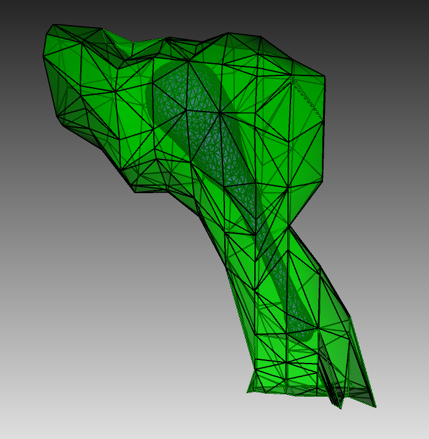
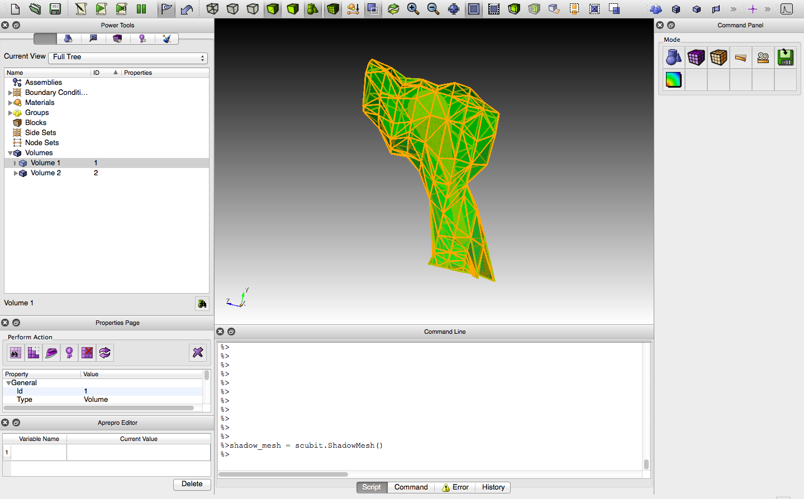

.. _geom_prep:

****************************************
STEPS-CUBIT Geometry Preparation Toolkit
****************************************

**This toolkit package is deprecated and not included in the current release. This page is kept for reference purpose.**

The simulation scripts described in this chapter are available at `ModelDB <http://senselab.med.yale.edu/modeldb/ShowModel.asp?model=153351>`_

In this chapter, we'll use simple models as examples to introduce the use of STEPS-CUBIT
geometry preparation toolkit described in `Python-based geometry preparation and simulation visualization toolkits for STEPS <http://journal.frontiersin.org/Journal/10.3389/fninf.2014.00037/abstract>`_

Please note that the generation of tetrahedral meshes will not be covered here and 
users are recommended to acquire support from individual mesh generation application.

In real research projects, tetrahedral meshes generated from generic mesh generator
are often inadequate for the prupose of simulation. Special treatments on the mesh,
such as substructure identification and biochemical model assocaition, are commonly
required prior to the simulation. The STEPS-CUBIT geometry preparation toolkit provides
useful utilities for these tasks.

API reference of this module can be accessed via :ref:`API_1_utilities_steps_cubit`

Prerequisites
===================

The toolkit requires `CUBIT <https://cubit.sandia.gov/>`_. CUBIT is a full-featured 
software toolkit for robust generation of two- and three-dimensional finite element 
meshes (grids) and geometry preparation. It provides both commercial and academic licenses,
as well as a 30-day demo trail.
 
STEPS (2.2.0 or above) source code package is also required.
CUBIT was used under rights and license from Sandia National Laboratories: Sandia License Number 09-N06832.

Installation
===================
The geometry preparation toolkit can be installed with or without STEPS integration with CUBIT, 
if it is installed without integration, preparation data is exported to a file and can be import
to STEPS mesh using STEPS importing utilities. If it is installed with integration, preparation
data can be directly written to :class:`steps.geom.Tetmesh` object in CUBIT.

Independent Installation
------------------------
1. Open CUBIT, under its script window, type in ::

    import sys
    print sys.path

There will be a list of paths, which indicates the PYTHONPATH configuration in CUBIT ::

    ['/Library/Python/2.5/site-packages/STEPS-2.2.0-py2.5-macosx-10.9-x86_64.egg', '/System/Library/Frameworks/Python.framework/Versions/2.5/lib/python25.zip', '/System/Library/Frameworks/Python.framework/Versions/2.5/lib/python2.5', '/System/Library/Frameworks/Python.framework/Versions/2.5/lib/python2.5/plat-darwin', '/System/Library/Frameworks/Python.framework/Versions/2.5/lib/python2.5/plat-mac', '/System/Library/Frameworks/Python.framework/Versions/2.5/lib/python2.5/plat-mac/lib-scriptpackages', '/System/Library/Frameworks/Python.framework/Versions/2.5/Extras/lib/python', '/System/Library/Frameworks/Python.framework/Versions/2.5/lib/python2.5/lib-tk', '/System/Library/Frameworks/Python.framework/Versions/2.5/lib/python2.5/lib-dynload', '/Library/Python/2.5/site-packages', '/System/Library/Frameworks/Python.framework/Versions/2.5/Extras/lib/python/PyObjC', '', '/Applications/Cubit-14.0/Cubit.app/Contents/MacOS', '/Applications/Cubit-14.0/Cubit.app/Contents/MacOS/structure', '/Applications/Cubit-14.0', '/Applications/Cubit-14.0/Cubit.app/Contents/MacOS/GUI']
    
one possible path is ::

    '/Library/Python/2.5/site-packages'
    
2. copy the **steps_cubit** folder under **STEPS_SOURCE_PACK/independent** to this path.

3. Restart CUBIT, in the script window type in ::

    import steps_cubit
    
If the following information appears then the toolkit is installed successfully. ::

    #################### CUBIT Mesh Preparation Support Toolkit for STEPS #################
                                    Version:  1.0.0

    # # # # # # # # # # # # # # # # # # # # # # # # # # # # # # # # # # # # # # # # #
    # STEPS - STochastic Engine for Pathway Simulation                              #
    # Copyright (C) 2007-2013 Okinawa Institute of Science and Technology, Japan.   #
    # Copyright (C) 2003-2006 University of Antwerp, Belgium.                       #
    #                                                                               #
    # See the file AUTHORS for details.                                             #
    #                                                                               #
    # This file is part of STEPS.                                                   #
    #                                                                               #
    # STEPS is free software: you can redistribute it and/or modify                 #
    # it under the terms of the GNU General Public License as published by          #
    # the Free Software Foundation, either version 3 of the License, or             #
    # (at your option) any later version.                                           #
    #                                                                               #
    # STEPS is distributed in the hope that it will be useful,                      #
    # but WITHOUT ANY WARRANTY; without even the implied warranty of                #
    # MERCHANTABILITY or FITNESS FOR A PARTICULAR PURPOSE. See the                  #
    # GNU General Public License for more details.                                  #
    #                                                                               #
    # You should have received a copy of the GNU General Public License             #
    # along with this program. If not, see <http://www.gnu.org/licenses/>.          #
    #                                                                               #
    # # # # # # # # # # # # # # # # # # # # # # # # # # # # # # # # # # # # # # # # #
        
                             steps.sourceforge.net
    #############################################################################
    
Integrative Installation
------------------------
1. Find out which version of Python is used in CUBIT, this can be done in CUBIT script window, type in ::

    import sys
    print sys.version

    2.5.6 (r256:Unversioned directory, Aug 25 2013, 00:03:43)
    [GCC 4.2.1 Compatible Apple LLVM 5.0 (clang-500.0.68)]

2. Locate the corresponding Python binary, and use it to install STEPS. For example, the above
information indicates that python2.5 is used. Open a terminal, and install STEPS as described in
:doc:`/getting_started`. ::

    python2.5 setup.py build
    [sudo] python2.5 setup.py install
    
3. Restart CUBIT, in script window type in ::
    import steps

4. The geometry preparation toolkit can be imported in CUBIT by typing in ::

    import steps.utilities.steps_cubit

Examples
========
Here we use two examples to explain how to use the toolkit for geometry preparation based on
different project requirements. Script and mesh data of these examples can be found at

`ModelDB <http://senselab.med.yale.edu/modeldb/ShowModel.asp?model=153351>`_

.. _spatial_ip3:

Spatial IP3 Receptor Model
--------------------------
This example is a spatial extension of the model described in :ref:`/ip3.ipynb`. To create a suitable 
geometry for the simulation, we extract a triangular spine morphology from an electron microscopic
reconstruction of spiny dendrites (`<http://synapses.clm.utexas.edu/anatomy/Ca1pyrmd/radiatum/K24/K24.stm>`_)
and artificially create a triangle mesh inside to represent the ER membrane of the spine.
This combined triangular surface mesh is then converted to a tetrahedral mesh in CUBIT. A CUBIT format of the 
mesh is provided in the example package (ip3r.cub).

   Geometry for the IP3R model simulation. Green: A spine morphology extracted from EM spiny dendrite reconstruction. Purple: triangular surface that divides the spine into ER and cytosol.

Although the mesh has already been split into two compartments by the ER membrane surface, it is still not 
yet ready for STEPS simulation. We are going to use the geometry preparation toolkit to perform 
following tasks:

1. Compartment and patch identification and tagging.
2. Biochemical model association with each compartment and patch.
3. Export the prepared data in a STEPS-ready format.

This can be done using either the indepedently installed toolkit, or integrative installed one.

With Independent Installation
^^^^^^^^^^^^^^^^^^^^^^^^^^^^^

1. We first open the mesh file in CUBIT, and import the toolkit in script window ::

    import steps_cubit as scubit
    
2. Since STEPS is not integrated with CUBIT, we need to create a :class:`steps_cubit.ShadowMesh` object which represents
the :class:`steps.geom.Tetmesh` object used in STEPS. type in ::

    shadow_mesh = scubit.ShadowMesh()

You can consider this shadow object as a data container for all preparation opeartions.

3. From CUBIT's component panel we can find out the Volume1 is the submesh for cytosol, and Volume2 is for
ER,

To give this information to the :class:`steps_cubit.ShadowMesh` object, we need to create two :class:`steps_cubit.ShadowComp` objects and assign it to shadow_mesh.
First, use mouse to select Volume1 in CUBIT's component panel, in the script window, type in ::

    shadow_cyt = scubit.selectedVolumesAsComp("cyt", shadow_mesh, ['vsys'])

This means we will use tetrahedrons in Volume1 to create a :class:`steps.geom.TmComp` object named "cyt",
and associate it with :class:`steps.model.Volsys` object named "vsys" when the mesh is imported to STEPS.

Similarly, we select Volume2 and type in ::

    shadow_ER = scubit.selectedVolumesAsComp("ER", shadow_mesh, ['vsys'])
    
4. We also need to assign the membrane surface as a :class:`steps_cubit.ShadowPatch` object so that it can be 
reconignzed by STEPS. To do so, right click Volume2 and choose "Draw". Now only Volume2 is display in
CUBIT. Switch to surface selection mode on the upper panel, then type in ::

    shadow_memb = scubit.selectedSurfacesAsPatch("memb", shadow_mesh, ['ssys'], shadow_ER, shadow_cyt)

This means the selected trangular surface will be used to create a :class:`steps.geom.TmPatch` named "memb",
and to associate with :class:`steps.model.Surfsys` named "ssys".

5. We now export the tetrahedral mesh and triangular surface mesh ::

    cubit.cmd('set Abaqus precision 6')
    cubit.cmd('export Abaqus "tets.inp" dimension 3 everything overwrite  cubitids ')
    cubit.cmd('block 1 tri in surface 21 ')
    cubit.cmd('export Abaqus "tris.inp" Block 1 dimension 3 overwrite  cubitids ')

Please refer to `CUBIT documentation <https://cubit.sandia.gov/public/documentation.html>`_ for details 
of above exporting command.

6. We also export the preparation information to a file ::

    shadow_mesh.exportTo("mesh_conf")
    
7. To use the mesh and preparation configuration in STEPS simulation, we can use :func:`steps.utilities.meshio.importAbaqus2` function in simulation script. ::

    import steps.utilities.meshio as meshio
    tetmesh = meshio.importAbaqus2('tets.inp', 'tris.inp', 1e-6, "mesh_conf")[0]

With Integrative Installation
^^^^^^^^^^^^^^^^^^^^^^^^^^^^^
The procedures are mostly the same, except that you can perform step 7 directly in CUBIT and 
save the :class:`steps.geom.Tetmesh` object using :func:`steps.utilities.meshio.saveMesh` ::

    meshio.saveMesh("ip3r_mesh", tetmesh)

.. todo:: More examples

Advanced Topic: Element Selection
=================================
In geometry preparation, element selection is essential since it is the starting point for
sub-component identification and model association, as shown in the example above. The STEPS-CUBIT
Geometry Preparation Toolkit provides flexibile solutions for this issue using varies CUBIT and STEPS
mechanisms. In this section we will explain the related API functions in the toolkit and their
suitable conditions.

Direct Selection from Component Panel
-------------------------------------
This is the simpliest solution, but only works if the element set has been constructed as a CUBIT component
, such as Volume or Surface, and is selectable in CUBIT's volume panel. In this case you can directly select
the component from the panel and call related API functions in the toolkit. This is the approach used in our
example above.

Related API Functions:
    * :func:`steps_cubit.getSelectedVolumes`
    * :func:`steps_cubit.getSelectedSurfaces`
    * :func:`steps_cubit.selectedVolumesAsComp`
    * :func:`steps_cubit.selectedSurfacesAsPatch`

.. raw:: html

        <object width="960" height="720"><param name="movie"
        value="http://www.youtube.com/v/g8RoPDngQPY"></param><param
        name="allowFullScreen" value="true"></param><param
        name="allowscriptaccess" value="always"></param><embed
        src="http://www.youtube.com/v/g8RoPDngQPY"
        type="application/x-shockwave-flash" allowscriptaccess="always"
        allowfullscreen="true" width="960"
        height="720"></embed></object>

Direct Box/Polygon Selection with Mouse
---------------------------------------
Sometimes the desired elements are only a subregion within a CUBIT component, which cannot be directly
selected from the component panel. In this case, CUBIT provides a Box/Polygon selection facility for
picking elements directly from the Main Window. X-ray selection is also possible so that not only "skin" 
elements, but also the ones hidden behind are selectable.

Please refer to `CUBIT manual <https://cubit.sandia.gov/public/14.1/help_manual/WebHelp/cubithelp.htm>`_ 
for the use of this selection method.

Related API Functions:
    * :func:`steps_cubit.getSelectedNodes`
    * :func:`steps_cubit.getSelectedTets`
    * :func:`steps_cubit.getSelectedTris`
    * :func:`steps_cubit.selectedTetsAsComp`
    * :func:`steps_cubit.selectedTrisAsPatch`
    * :func:`steps_cubit.selectedNodesAsROI`
    * :func:`steps_cubit.selectedTetsAsROI`
    * :func:`steps_cubit.selectedTrisAsROI`
    

.. raw:: html

        <object width="960" height="720"><param name="movie"
        value="http://www.youtube.com/v/Ic2S28FC3BM"></param><param
        name="allowFullScreen" value="true"></param><param
        name="allowscriptaccess" value="always"></param><embed
        src="http://www.youtube.com/v/Ic2S28FC3BM"
        type="application/x-shockwave-flash" allowscriptaccess="always"
        allowfullscreen="true" width="960"
        height="720"></embed></object>

Indeirect Bounding Object Selection
-----------------------------------
If the desired elements are hidden completely behind other elements, or the selection requires more specific
boundary instead of a manual created Box/Polygon with mouse, the above two methods may not be suitable.
The toolkit provides an indirect bounding object selection method which allows element selection within
a complex, user-defined bounding object.

To do this, we first generate a reduced element list using the above two methods. The reduced list should
contain all desired elements, but can have other elements as well. Then we create the desired bounding object
in CUBIT, this can be done either in python script,or manually using CUBIT's geometry creation interface. 
Elements bound within this object can be accessed and used to create STEPS compatment/patch with 
following functions.

Related API Functions:
    * :func:`steps_cubit.getNodesBoundInSelectedVols`
    * :func:`steps_cubit.getTetsBoundInSelectedVols`
    * :func:`steps_cubit.getTrisBoundInSelectedVols`
    * :func:`steps_cubit.boundTetsAsComp`
    * :func:`steps_cubit.boundTrisAsPatch`
    * :func:`steps_cubit.boundNodesAsROI`
    * :func:`steps_cubit.boundTetsAsROI`
    * :func:`steps_cubit.boundTrisAsROI`
    
.. raw:: html

        <object width="960" height="720"><param name="movie"
        value="http://www.youtube.com/v/1O6N0RHjzSc"></param><param
        name="allowFullScreen" value="true"></param><param
        name="allowscriptaccess" value="always"></param><embed
        src="http://www.youtube.com/v/1O6N0RHjzSc"
        type="application/x-shockwave-flash" allowscriptaccess="always"
        allowfullscreen="true" width="960"
        height="720"></embed></object>

Other Supporting Functions
==========================

The following functions are designed for component display and validation.

Related API Functions:
    * :func:`steps_cubit.drawROI`
    * :func:`steps_cubit.drawComp`
    * :func:`steps_cubit.drawPatch`
    * :func:`steps_cubit.highlightROI`
    * :func:`steps_cubit.highlightComp`
    * :func:`steps_cubit.highlightPatch`
    * :func:`steps_cubit.toStr`

