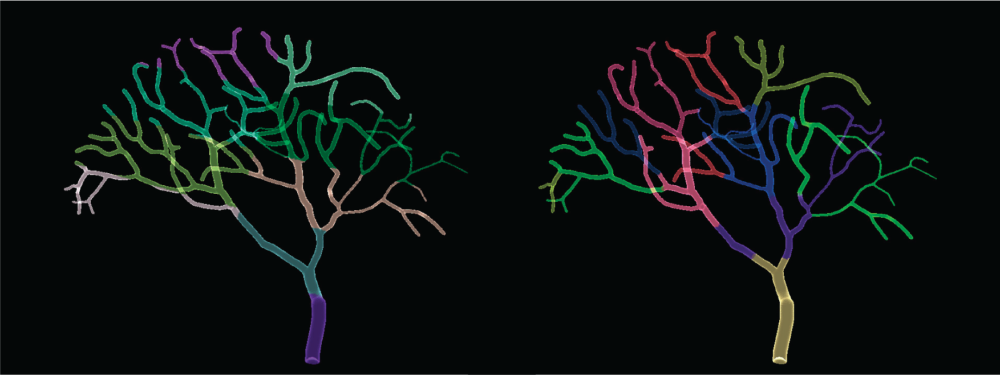

.. _parallel:

********************************************************************
From Serial to Parallel (Parallel TetOpSplit Solver)
********************************************************************

The simulation script described in this chapter is available at `STEPS_Example repository <https://github.com/CNS-OIST/STEPS_Example/tree/master/python_scripts/parallel>`_.

The TetOpSplit solver is avialble for STEPS 3.0.0 and above.
Please note that the solver is still under active  development
and some of the functionaliies are not yet available or with limited support.
Here is the feature status of solver:

* Fully Supported
    - Non-interactive parallel stochastic spatial reaction-difusion-EField simulation (similar to Tetexact)

* Not Yet Supported
    - Checkpointing
    - dynamic load balancing
    - Simulation visualization

For more details about the accuracy and performace of the parallel TetOpSplit solver, please
check the following papers:

Hepburn, I., Chen, W., and De Schutter, E. (2016). **Accurate reaction-diffusion operator splitting on tetrahedral meshes for parallel stochastic molecular simulations.** J. Chem. Phys. 145, 054118–22. doi:10.1063/1.4960034.

Chen W and De Schutter E (2017). **Parallel STEPS: Large Scale Stochastic Spatial Reaction-Diffusion
Simulation with High Performance Computers.** Front. Neuroinform. 11:13. doi: 10.3389/fninf.2017.00013.

Reaction-Diffusion Simulation
=============================

Let's first see how to convert a normal serial Tetexact reaction-diffusion simulation to
a parallel TetOpSplit simulation. Below is the Tetexact simulation script,

.. literalinclude:: examples/parallel/ssa_simulation.py

And here is the parallel TetOpSplit version,

.. literalinclude:: examples/parallel/parallel_simulation.py

So what are the differences? Actually not that many. Parallel TetOpSplit is designed in the way that
a serial Tetexact simulation can be easily converted to the parallel version with
minimal script modifications. Here is the general procedure:

Replace the modules
-------------------
.. code-block:: python

    # Serial Tetexact
    import steps.solver as ssa_solver

    # Parallel TetOpSplit
    import steps.mpi
    import steps.mpi.solver as parallel_solver
    import steps.utilities.geom_decompose as gd

The steps.mpi module needs to be imported before the steps.mpi.solver submodule,
it provides two important variables for parallel simulation, :data:`steps.mpi.nhosts` provides
the number of MPI processes used in the simulation, and the :data:`steps.mpi.rank` provides
the MPI rank of the current process.

The :mod:`steps.utilities.geom_decompose` module contains functions for
mesh partitioning, which are often used in parallel STEPS simulations.

Partition the mesh
------------------
In the current parallel implementation, a partitioning list is required to distribute the
tetrahedrons and triangles to each MPI process. the :func:`steps.utilities.geom_decompose.linearPartition`
function provides a grid based partitioning solution for simple geometry:

.. code-block:: python

    # Partition a mesh g into n segments along the z axis,
    # where n is the number of MPI processes in the simulation,
    # and return the partitioning list as tet_hosts

    tet_hosts = gd.linearPartition(g, [1, 1, steps.mpi.nhosts])

The three elements in the list [1, 1, steps.mpi.nhosts] represent
the numbers of partitions along the x, y and z directions.
the function returns a list which indicates the assigned process rank for each tetrahedron,
for example, the host process for tetrahedron 2 is stored in tet_hosts[2].

For complex geometries such as a dendrite tree, grid-based partitioning may not be the best choice.
In this case, other third party partitioning software such as Metis can be used. We will come back
to this topic later.

If your model has patches, the :func:`steps.utilities.geom_decompose.partitionTris` function can
automatically partition the patch triangles according to the tetrahedron partitioning list.

.. code-block:: python

    tet_hosts = gd.linearPartition(g, [1, 1, steps.mpi.nhosts])
    tri_hosts = gd.partitionTris(g, tet_hosts, YOUR_TRI_ID_LIST)

You can validate and print out the stats of your partitioning like this

.. code-block:: python

    if steps.mpi.rank == 0:
        gd.validatePartition(g, tet_hosts)
        gd.printPartitionStat(tet_hosts)

The if line is needed because we only want process 0 to print out the text.

Create files for recording
--------------------------

It is often necessary to record data from the simulation, in a serial Tetexact simulation,
the data files can be created easily like this

.. code-block:: python

    # create a summary file "result.csv" in the "RESULT_DIR" directory

    try: os.mkdir(RESULT_DIR)
    except: pass

    summary_file = open(RESULT_DIR + "/result.csv", 'w', 0)
    summary_file.write("Simulation Time,A,B,C,D,E,F,G,H,I,J\n")

However, in a parallel TetOpSplit simulation, you need to consider which process is responsible
for data recording. There are two commonly used approaches, firstly, assign one process (such as process 0)
specifically for recording

.. code-block:: python

    if steps.mpi.rank == 0:
        try: os.mkdir(RESULT_DIR)
        except: pass

        summary_file = open(RESULT_DIR + "/result.csv", 'w', 0)
        summary_file.write("Simulation Time,A,B,C,D,E,F,G,H,I,J\n")

or secondly, each process record a copy of the data

.. code-block:: python

    if steps.mpi.rank == 0:
        try: os.mkdir(RESULT_DIR)
        except: pass

    summary_file = open(RESULT_DIR + "/result_proc%i.csv" % (steps.mpi.rank), 'w', 0)
    summary_file.write("Simulation Time,A,B,C,D,E,F,G,H,I,J\n")

Which approach you use depends on what data you want to record, functions like
:func:`steps.mpi.solver.TetOpSplit.getCompCount` needs to be called in every process and returns
the same result to each process when called; on the other hand,
:func:`steps.mpi.solver.TetOpSplit.getIdleTime` returns different result for each process,
in which case the second recording method is necessary.

Create solver and run the simulation
------------------------------------

We now create a TetOpSplit solver to replace the Tetexact solver

.. code-block:: python

    # Serial Tetexact
    sim = ssa_solver.Tetexact(m, g, rng)

    # Parallel TetOpSplit
    sim = parallel_solver.TetOpSplit(m, g, rng, parallel_solver.EF_NONE, tet_hosts)

`parallel_solver.EF_NONE` tells the solver that no parallel EField solver is needed for
the simulation, we will talk about the parallel EField solvers later. `tet_hosts` is the
tetrahedron partitioning list we generated above. If your model has patches, you also
need to fill in the triangle partitioning info.

.. code-block:: python

    sim = parallel_solver.TetOpSplit(m, g, rng, parallel_solver.EF_NONE, tet_hosts, tri_hosts)

You can control the simulation run pretty much the same as the serial solver, just need to remember that
if you use a specific process for data recording, you need to ask the assigned process to write the data alone.

.. code-block:: python

    if steps.mpi.rank == 0:
        summary_file.write("%f,%i,%i,%i,%i,%i,%i,%i,%i,%i,%i\n" % \
        (current_simtime, A_count, B_count, C_count, D_count, E_count, \
        F_count, G_count, H_count, I_count, J_count))

Also note that :func:`steps.mpi.solver.TetOpSplit.getCompCount` is a global collective
function that needs to be called in every process at the same time (including most functions inherited from Tetexact),
so you cannot do the following

.. code-block:: python

    # this is not correct
    if steps.mpi.rank == 0:
        summary_file.write("%i" % sim.getCompCount('comp', 'A'))

At the end of your simulation, remember to close the data file and we are done.

.. code-block:: python

    if steps.mpi.rank == 0:
        summary_file.close()

Simulation execution
--------------------
Youc can run a parallel TetOpSplit simulation by calling 'mpirun' or similar executable provided by your MPI distribution.

.. code-block:: bash

    mpirun -n NPROCS python my_parallel_sim.py

NPROCS is the number of MPI processes used in your simulation.

Complex Mesh Partitioning
=========================

The grid-based partitioning approach may not be suitable for complex geometries, such as a dendritic tree,
in this case, we suggest use third party partitioning tools such as `Metis <http://glaros.dtc.umn.edu/gkhome/metis/metis/overview>`_. The :mod:`steps.utilities.metis_support` module provides supporting functions
for data exchange between STEPS and Metis. To partition a STEPS Tetmesh using Metis, we need to first convert
the tetrahedron connectivity information in the mesh to Metis format,

.. code-block:: python

    import steps.utilities.geom_decompose as gd
    import steps.utilities.meshio as meshio
    import steps.utilities.metis_support as metis

    MESH_FILE = "mymesh.inp"
    mesh = meshio.importAbaqus(MESH_FILE, 1e-6)[0]

    # save the connectivity to mymesh.metis
    metis.tetmesh2metis(mesh, 'mymesh.metis')

then call Metis either from a bash terminal,

.. code-block:: bash

    mpmetis -ncommon=3 -minconn -niter=1000 mymesh.metis 10

or from python

.. code-block:: python

    call(['mpmetis', '-ncommon=3', '-minconn', '-niter=1000', 'mymesh.metis', '10'])

Metis will partition the mesh into 10 segments and store the partition information to "mymesh.metis.epart.10".
Details of Metis parameters can be found in
`Metis User Mamnual <http://glaros.dtc.umn.edu/gkhome/fetch/sw/metis/manual.pdf>`_. After
the partitioning, you can read the partition information from the file using

.. code-block:: python

    tet_hosts = metis.readPartition('mymesh.metis.epart.10')

and use it to construct your TetOpSplit solver.

If you have PyQtGraph and PyOpenGL installed, you can visualize the partitions of the mesh using

.. code-block:: python

    import steps.visual
    import pyqtgraph as pg
    app = pg.mkQApp()

    w = steps.visual.TetPartitionDisplay(mesh, tet_hosts, w = 1200, h = 800)
    w = steps.visual.TriPartitionDisplay(mesh, tri_hosts, w = 1200, h = 800)
    app.exec_()

:ref:`Figure below <figure_partition_compare>` shows the difference between partitioning using grid-based STEPS toolkit and Metis, on a dendritic tree morphology.

.. _figure_partition_compare:

   
   `Visual comparision of grid-based (left) partitioning and partitioning using Metis (right). Each color represents a mesh partition to be assigned to a MPI process.`

Parallel EField Simulation
==========================

The parallel TetOpSplit solver in STEPS 3.0.0 includes several prototypes for combined simulations with both reaction-diffusion and EField.
The prototypes can be switched by changing the `calcMembPot` parameter in the TetOpSplit constructor.
Here are the possible options:

* .. data:: steps.mpi.solver.EF_NONE

    No EField solver is needed.

* .. data:: steps.mpi.solver.EF_DEFAULT

    Run serial EField simulation (Tetexact version) on process 0.

* .. data:: steps.mpi.solver.EF_DV_SLUSYS

    Use parallel SuperLU EField solver.

* .. data:: steps.mpi.solver.EF_DV_PETSC

    Use parallel PETSc EField solver.

The default value is `EF_NONE`, i.e. no EField is simulated. For scale EFIeld simulation we recommand the `EF_DV_SLUSYS` solver, for large scale EField simulation we recommand the `EF_DV_PETSC` solver.

Here is an example of the Hodgkin-Huxley Action Potential propagation simulation (see :doc:`/memb_pot`) using parallel TetOpSplit with SuperLU EField solver.

.. literalinclude:: examples/parallel/HH_APprop_tetopsplit.py

