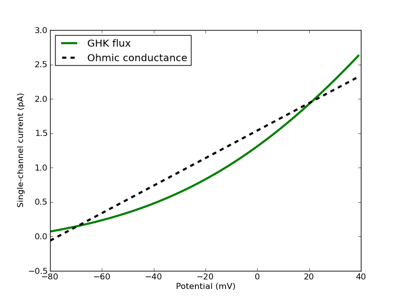
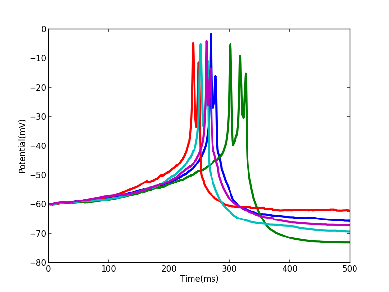

.. _stoch_spikes:

*************************************************
Stochastic Calcium Burst model with GHK currents
*************************************************

*This chapter is based on the publication "Anwar H, Hepburn I, Nedelescu H, Chen W, De Schutter E (2013) Stochastic 
Calcium Mechanisms Cause Dendritic Calcium Spike Variability. The Journal of Neuroscience, 33(40): 15848-15867". The model 
file is StochasticCaburst.py which is available at http://senselab.med.yale.edu/modeldb/ShowModel.asp?model=150635 and should 
be run within the complete modelling package because it depends on other files such as /extra/constants.py.*

The simulation script described in this chapter is also available at `STEPS_Example repository <https://github.com/CNS-OIST/STEPS_Example/tree/master/publication_models/Anwar_J%20Neurosci_2013>`_.

This chapter builds on previous chapters by simulating a model that includes both a reaction-diffusion component as well as  
electrical excitability. As described in [#f1]_, the two are closely coupled and this model contains ion channels where
activation is both voltage-dependent and calcium-dependent. In addition, the calcium ions form an important part of the 
current across the membrane, further coupling the reaction-diffusion component with the electrical excitability. This 
chapter introduces an important new object: the GHK Current object, which is described in some detail in section :ref:`ptype`.

As in previous chapters we will go through the script, looking in some depth at new concepts, but only brief explanations
will be offered of things that have been described in previous chapters. 

Modelling solution
==================

At the top of the script, as usual, we import some modules, including STEPS modules and some self-written helper modules. This
import includes the extra/constants.py file, which includes all important parameters for the module such as physical 
constants, membrane properties, kinetic properties of the channels, initial conditions and so on::

    import math
    import time
    from random import *
    import sys
    import os

    import steps.model as smodel
    import steps.geom as sgeom
    import steps.rng as srng
    import steps.utilities.meshio as meshio
    import steps.solver as ssolver
    
    import meshes.gettets as gettets
    from extra.constants import *
    
.. _constants:

extra/constants.py file
---------------------------

Although not part of this model script, for easy reference to many important parameters used in the model this is the contents of the imported 
extra.constants module. What these parameters are and how they are used will become apparent as we go through the model. All unit are S.I. units, 
with the exception of concentration where units are molar::

    # # # # # # # # # # # # # # # # # # # # # # # # # # # # # # # # # # # # # # #

    import math

    # # # # # # # # # # # # # # # # SIMULATION CONTROLS # # # # # # # # # # # # #

    EF_DT = 2.0e-5          # The EField dt
    NTIMEPOINTS =  25001 
     
    TIMECONVERTER =  2.0e-5

    NITER = 1

    ############################ PARAMETERS ################################

    init_pot = -60e-3

    TEMPERATURE = 34.0

    Q10 = 3

    # Faraday constant: unit of FARADAY is C/mol 
    # Source: http://physics.nist.gov/cgi-bin/cuu/Value?f 24/2/2012
    FARADAY = 96485.3365

    # Molar Gas Constant: unit of R is J/mol K
    # Source: http://physics.nist.gov/cgi-bin/cuu/Value?r 24/2/2012
    R = 8.3144621

    # Avogadro constant: unit of AVOGADRO is /mol
    # Source: http://physics.nist.gov/cgi-bin/cuu/Value?na 24/2/2012
    AVOGADRO = 6.02214129e23

    # Elementary charge: unit of E_CHARGE is C
    # Source: http://physics.nist.gov/cgi-bin/cuu/Value?e 24/2/2012
    E_CHARGE = 1.602176565e-19

    #FOR MSLO, THERE IS A NEW VALUE FOR Qt wrt to 25 degC
    Qt = math.pow(Q10, ((TEMPERATURE-23)/10))
    Qt_mslo = math.pow(Q10, ((TEMPERATURE-25)/10))

    ########## BULK RESISTIVITY ##########

    Ra = 235.7*1.0e-2

    ########## MEMBRANE CAPACITANCE ##########

    memb_capac = 1.5e-2

    ########## CaP channels density & permiability per channel ##########

    # CaP_P is permiability per channel (m3/s)
    # CaP_ro is channel/surface area (/m2)
    # P in Ca Dynamics model is 0.95e-4 cm/s --> 0.95e-6 m/s

    CaP_P = 2.5e-20 
    CaP_ro = 3.8e13

    ##########CaP channel parameters ####################

    #Units (mV)
    vhalfm = -29.458
    cvm = 8.429

    def minf_cap(V):
        #Units (mV)
        vhalfm = -29.458
        cvm = 8.429
        vshift = 0.0
        
        return (1.0/(1.0 + math.exp(-(V-vhalfm-vshift)/cvm)))

    def tau_cap(V):
        vshift = 0.0
        if (V-vshift) >= -40:
            return (0.2702 + 1.1622 * math.exp(-(V+26.798-vshift)*(V+26.798-vshift)/164.19))
        else:
            return (0.6923 * math.exp((V-vshift)/1089.372))

    def alpha_cap(V):
        return (minf_cap(V)/tau_cap(V))

    def beta_cap(V):
        return ((1.0-minf_cap(V))/tau_cap(V))

    ## Intitial conditions

    CaP_m0_p = 0.92402
    CaP_m1_p = 0.073988
    CaP_m2_p = 0.0019748
    CaP_m3_p = 1.7569e-05

    ########## CaT channels density & permiability per channel ##########

    # CaT_P is permiability per channel (m3/s)
    # CaT_ro is channel/surface area (/m2)
    # P in Ca Dynamics model is 6.2e-6 cm/s -->6.2e-8 m/s

    CaT_P = 1.65e-20
    CaT_ro = 3.7576e12

    def minf_cat(V):
        #Units (mV)
        vhalfm = -52.0
        cvm = -5.0
        vshift = 0.0
        
        return (1.0/(1.0 + math.exp((V-vhalfm-vshift)/cvm)))

    def taum_cat(V):
        vshift = 0.0
        if V > -90.0:
            return (1.0 + 1.0 / (math.exp((V+40.0-vshift)/9.0) + math.exp(-(V+102.0-vshift)/18.0)))
        else:
            return 1.0

    def hinf_cat(V):
        vhalfh = -72.0
        cvh = 7.0
        vshift = 0.0
        return (1.0/(1.0 + math.exp((V-vhalfh-vshift)/cvh)))

    def tauh_cat(V):
        vshift = 0.0
        return (15.0 + 1.0 / (math.exp((V+32.0-vshift)/7.0)))

    def alpham_cat(V):
        return (minf_cat(V)/taum_cat(V))

    def betam_cat(V):
        return ((1-minf_cat(V))/taum_cat(V))

    def alphah_cat(V):
        return (hinf_cat(V)/tauh_cat(V))

    def betah_cat(V):
        return ((1-hinf_cat(V))/tauh_cat(V))

    ## Initial conditions

    CaT_m0h0_p = 0.58661
    CaT_m1h0_p = 0.23687
    CaT_m2h0_p = 0.023912
    CaT_m0h1_p = 0.10564
    CaT_m1h1_p = 0.042658
    CaT_m2h1_p = 0.0043063

    ########## BK channels density & conductance per channel ##########

    # Total conductance = BK_G (conductance/channel) * BK_ro (channel/surface area)
    # BK in Ca Dynamics model is 4.25e-2 S/cm2 --> 4.25e2 S/m2

    BK_G = 2.1e-10
    BK_ro = 2.0238e12
    BK_rev = -77e-3

    ######### BK channel parameters ######################

    #Units (1)
    Qo = 0.73
    Qc = -0.67

    #Units (/s)
    pf0 = 2.39
    pf1 = 5.4918
    pf2 = 24.6205
    pf3 = 142.4546
    pf4 = 211.0220

    pb0 = 3936
    pb1 = 687.3251
    pb2 = 234.5875
    pb3 = 103.2204
    pb4 = 11.6581

    #Units(/M)
    k1 = 1.0e6

    #Units(/s)
    onoffrate = 1.0e3

    L0 = 1806

    #Units (M)
    Kc = 8.63e-6
    Ko = 0.6563e-6

    c_01 = 4.*k1*onoffrate*Qt_mslo
    c_12 = 3.*k1*onoffrate*Qt_mslo
    c_23 = 2.*k1*onoffrate*Qt_mslo
    c_34 = 1.*k1*onoffrate*Qt_mslo
    o_01 = 4.*k1*onoffrate*Qt_mslo
    o_12 = 3.*k1*onoffrate*Qt_mslo
    o_23 = 2.*k1*onoffrate*Qt_mslo
    o_34 = 1.*k1*onoffrate*Qt_mslo

    c_10 = 1.*Kc*k1*onoffrate*Qt_mslo
    c_21 = 2.*Kc*k1*onoffrate*Qt_mslo
    c_32 = 3.*Kc*k1*onoffrate*Qt_mslo
    c_43 = 4.*Kc*k1*onoffrate*Qt_mslo
    o_10 = 1.*Ko*k1*onoffrate*Qt_mslo
    o_21 = 2.*Ko*k1*onoffrate*Qt_mslo
    o_32 = 3.*Ko*k1*onoffrate*Qt_mslo
    o_43 = 4.*Ko*k1*onoffrate*Qt_mslo

    f_0 = lambda mV: pf0*Qt_mslo*(math.exp((Qo* FARADAY* mV) / (R* (TEMPERATURE + 273.15))))
    f_1 = lambda mV: pf1*Qt_mslo*(math.exp((Qo* FARADAY* mV) / (R* (TEMPERATURE + 273.15))))
    f_2 = lambda mV: pf2*Qt_mslo*(math.exp((Qo* FARADAY* mV) / (R* (TEMPERATURE + 273.15))))
    f_3 = lambda mV: pf3*Qt_mslo*(math.exp((Qo* FARADAY* mV) / (R* (TEMPERATURE + 273.15))))
    f_4 = lambda mV: pf4*Qt_mslo*(math.exp((Qo* FARADAY* mV) / (R* (TEMPERATURE + 273.15))))

    b_0 = lambda mV: pb0*Qt_mslo*(math.exp((Qc* FARADAY* mV) / (R* (TEMPERATURE + 273.15))))
    b_1 = lambda mV: pb1*Qt_mslo*(math.exp((Qc* FARADAY* mV) / (R* (TEMPERATURE + 273.15))))
    b_2 = lambda mV: pb2*Qt_mslo*(math.exp((Qc* FARADAY* mV) / (R* (TEMPERATURE + 273.15))))
    b_3 = lambda mV: pb3*Qt_mslo*(math.exp((Qc* FARADAY* mV) / (R* (TEMPERATURE + 273.15))))
    b_4 = lambda mV: pb4*Qt_mslo*(math.exp((Qc* FARADAY* mV) / (R* (TEMPERATURE + 273.15))))

    # Initial conditions
    BK_C0_p= 0.99997
    BK_C1_p= 4.3619e-07
    BK_C2_p= 4.1713e-09
    BK_C3_p= 4.4449e-11
    BK_C4_p= 6.3132e-14

    BK_O0_p= 2.5202e-05
    BK_O1_p= 1.1765e-06
    BK_O2_p= 6.6148e-08
    BK_O3_p= 2.4392e-09
    BK_O4_p= 4.0981e-11

    ########## SK channel density & conductance per channel #############

    # Total conductance = SK_G (conductance/channel) * SK_ro (channel/surface area)
    # SK in Ca Dynamics model is 3.1e-4 S/cm2 --> 3.1 S/m2

    SK_G = 1.0e-11
    SK_ro = 31.0e10

    SK_rev = -77e-3

    ######### SK channel parameters ###################

    #Units (/s)
    invc1 = 80
    invc2 = 80
    invc3 = 200

    invo1 = 1000
    invo2 = 100

    diro1 = 160
    diro2 = 1200

    #Units ( /s M)

    dirc2 = 200e6
    dirc3 = 160e6
    dirc4 = 80e6

    invc1_t = invc1*Qt
    invc2_t = invc2*Qt
    invc3_t = invc3*Qt

    invo1_t = invo1*Qt
    invo2_t = invo2*Qt

    diro1_t = diro1*Qt
    diro2_t = diro2*Qt

    dirc2_t = dirc2*Qt/3.0
    dirc3_t = dirc3*Qt/3.0
    dirc4_t = dirc4*Qt/3.0

    # Intital conditions
    SK_C1_p= 0.96256
    SK_C2_p= 0.036096
    SK_C3_p= 0.0010829
    SK_C4_p= 6.4973e-06

    SK_O1_p= 0.00017326
    SK_O2_p= 7.7967e-05

    ######### leak current channel density & conductance per channel ########
    # Total conductance = 1e-6 S/cm2 --> 1e-2 S/m2

    L_G = 4.0e-14
    L_ro = 25.0e10

    L_rev = -61e-3

    ######### Pump parameters ###################

    P_f_kcst = 3e9
    P_b_kcst = 1.75e4
    P_k_kcst = 7.255e4

    ############################CALCIUM BUFFERING MODEL################################

    ########## Ca concentrations #########

    Ca_oconc = 2e-3
    Ca_iconc = 45e-9

    ########## Mg concentrations #########

    Mg_conc = 590e-6

    ########## Buffer concentrations #############

    iCBsf_conc = 27.704e-6
    iCBCaf_conc = 2.6372e-6
    iCBsCa_conc= 1.5148e-6
    iCBCaCa_conc= 0.14420e-6

    CBsf_conc= 110.82e-6
    CBCaf_conc= 10.549e-6
    CBsCa_conc= 6.0595e-6
    CBCaCa_conc= 0.57682e-6

    PV_conc= 3.2066e-6
    PVCa_conc= 16.252e-6
    PVMg_conc= 60.541e-6

    # Diffusion constant of Calcium
    DCST = 0.223e-9
    # Diffusion constant of Calbindin (CB)
    DCB = 0.028e-9
    # Diffusion constant of Parvalbumin (PV)
    DPV = 0.043e-9

    #iCBsf-fast
    iCBsf1_f_kcst = 4.35e7
    iCBsf1_b_kcst = 35.8

    #iCBsCa
    iCBsCa_f_kcst = 0.55e7
    iCBsCa_b_kcst = 2.6

    #iCBsf_slow
    iCBsf2_f_kcst = 0.55e7
    iCBsf2_b_kcst = 2.6

    #iCBCaf
    iCBCaf_f_kcst = 4.35e7
    iCBCaf_b_kcst = 35.8

    #CBsf-fast
    CBsf1_f_kcst = 4.35e7
    CBsf1_b_kcst = 35.8

    #CBsCa
    CBsCa_f_kcst = 0.55e7
    CBsCa_b_kcst = 2.6

    #CBsf_slow
    CBsf2_f_kcst = 0.55e7
    CBsf2_b_kcst = 2.6

    #CBCaf
    CBCaf_f_kcst = 4.35e7
    CBCaf_b_kcst = 35.8

    #PVca
    PVca_f_kcst = 10.7e7
    PVca_b_kcst = 0.95

    #PVmg
    PVmg_f_kcst = 0.8e6
    PVmg_b_kcst = 25

    # # # # # # # # # # # # # # # # # # # # # # # # # # # # # # # # # # # # # # #

Command line execution
----------------------

Back to the StochasticCaburst.py script, and next we take a slightly new approach to previous models, in which we utilise command line arguments (``sys.argv``).
The 'zeroth' argument (``sys.argv[0]``) is the script pathname, then other arguments are command line arguments which are read as 
strings. In this sense it is intended that the StochasticCaburst.py script is run from the command line with a statement such as::

    $ python StochasticCaburst.py Cylinder2_dia2um_L10um_outer0_3um_0.3shell_0.3size_19156tets_adaptive.inp ~/stochcasims/ 1

and, in the present form, this script can not be run interactively as previous examples can. In the script, we read command line arguments thusly::

    meshfile_ab, root, iter_n = sys.argv[1], sys.argv[2], sys.argv[3]

Looking at the above example, sys.argv[1] would be the string 'Cylinder2_dia2um_L10um_outer0_3um_0.3shell_0.3size_19156tets_adaptive.inp' 
and will be stored as variable ``meshfile_ab``, 
sys.argv[2] will be the string '~/stochcasims/' and stored as variable ``root`` which, as we will see, defines where to store
simulation output, and sys.argv[3] will be the string '1' and stored as variable ``iter_n`` which is involved in random 
number initialisation (after conversion to an integer) and data storage. We will look at these variables later in the script as they are used. 

The last thing to be done before moving onto the biochemical model description is to set a flag to detect whether we are 
dealing with the 160um mesh (available meshes that are intended for this simulation are cylinders all of diameter 2um and lengths of 10um, 
20um, 40um, 80um and 160um). This flag is necessary because the 160um mesh has slightly different properties 
than the other meshes in that it contains no extracellular tetrahedral compartment, and so there will be some different behaviours throughout the script 
depending on whether we are using the 160um mesh or not::

    if meshfile_ab == 'Cylinder2_dia2um_L160um_outer0_0.3shell_0.3size_279152tets_adaptive.inp': cyl160=True
    else: cyl160=False

Model specification
===================

Since this is a relatively large model we will split its description up into two sections, after first creating the parent 
model container object, one volume system and one surface system::

    mdl = smodel.Model()

    # Vol/surface systems
    vsys = smodel.Volsys('vsys', mdl)
    ssys = smodel.Surfsys('ssys', mdl)

.. _calc_dyn:

Calcium dynamics
--------------------

The following lines of code describe the calcium and calcium buffer reactions and diffusion. Since these are 'ordinary' 
dynamics with no voltage-dependence we will not look look at this part in detail. A more detailed explanation is offered
in [#f1]_ and [#f2]_. Most parameters come from the :ref:`constants`::

    # Calcium
    Ca = smodel.Spec('Ca', mdl)
    Ca.setValence(2)

    # Pump
    Pump = smodel.Spec('Pump', mdl)
    # CaPump
    CaPump = smodel.Spec('CaPump', mdl)

    # iCBsf
    iCBsf = smodel.Spec('iCBsf', mdl)
    # iCBsCa
    iCBsCa = smodel.Spec('iCBsCa', mdl)
    # iCBCaf
    iCBCaf = smodel.Spec('iCBCaf', mdl)
    # iCBCaCa
    iCBCaCa = smodel.Spec('iCBCaCa', mdl)

    # CBsf
    CBsf = smodel.Spec('CBsf', mdl)
    # CBsCa
    CBsCa = smodel.Spec('CBsCa', mdl)
    # CBCaf
    CBCaf = smodel.Spec('CBCaf', mdl)
    # CBCaCa
    CBCaCa = smodel.Spec('CBCaCa', mdl)

    # PV
    PV = smodel.Spec('PV', mdl)
    # PVMg
    PVMg = smodel.Spec('PVMg', mdl)
    # PVCa
    PVCa = smodel.Spec('PVCa', mdl)
    # Mg
    Mg = smodel.Spec('Mg', mdl)
    
    diff_Ca = smodel.Diff('diff_Ca', vsys, Ca)
    diff_Ca.setDcst(DCST)
    diff_CBsf = smodel.Diff('diff_CBsf', vsys, CBsf)
    diff_CBsf.setDcst(DCB)
    diff_CBsCa = smodel.Diff('diff_CBsCa', vsys, CBsCa)
    diff_CBsCa.setDcst(DCB)
    diff_CBCaf = smodel.Diff('diff_CBCaf', vsys, CBCaf)
    diff_CBCaf.setDcst(DCB)
    diff_CBCaCa = smodel.Diff('diff_CBCaCa', vsys, CBCaCa)
    diff_CBCaCa.setDcst(DCB)
    diff_PV = smodel.Diff('diff_PV', vsys, PV)
    diff_PV.setDcst(DPV)
    diff_PVCa = smodel.Diff('diff_PVCa', vsys, PVCa)
    diff_PVCa.setDcst(DPV)
    diff_PVMg = smodel.Diff('diff_PVMg', vsys, PVMg)
    diff_PVMg.setDcst(DPV)

    #Pump
    PumpD_f = smodel.SReac('PumpD_f', ssys, ilhs=[Ca], slhs=[Pump], srhs=[CaPump])
    PumpD_f.setKcst(P_f_kcst)

    PumpD_b = smodel.SReac('PumpD_b', ssys, slhs=[CaPump], irhs=[Ca], srhs=[Pump])
    PumpD_b.setKcst(P_b_kcst)

    PumpD_k = smodel.SReac('PumpD_k', ssys, slhs=[CaPump], srhs=[Pump])
    PumpD_k.setKcst(P_k_kcst)

    #iCBsf-fast
    iCBsf1_f = smodel.Reac('iCBsf1_f', vsys, lhs=[Ca,iCBsf], rhs=[iCBsCa], kcst = iCBsf1_f_kcst)
    iCBsf1_b = smodel.Reac('iCBsf1_b', vsys, lhs=[iCBsCa], rhs=[Ca,iCBsf], kcst = iCBsf1_b_kcst)

    #iCBsCa
    iCBsCa_f = smodel.Reac('iCBsCa_f', vsys, lhs=[Ca,iCBsCa], rhs=[iCBCaCa], kcst = iCBsCa_f_kcst)
    iCBsCa_b = smodel.Reac('iCBsCa_b', vsys, lhs=[iCBCaCa], rhs=[Ca,iCBsCa], kcst = iCBsCa_b_kcst)

    #iCBsf_slow
    iCBsf2_f = smodel.Reac('iCBsf2_f', vsys, lhs=[Ca,iCBsf], rhs=[iCBCaf], kcst = iCBsf2_f_kcst)
    iCBsf2_b = smodel.Reac('iCBsf2_b', vsys, lhs=[iCBCaf], rhs=[Ca,iCBsf], kcst = iCBsf2_b_kcst)

    #iCBCaf
    iCBCaf_f = smodel.Reac('iCBCaf_f', vsys, lhs=[Ca,iCBCaf], rhs=[iCBCaCa], kcst = iCBCaf_f_kcst)
    iCBCaf_b = smodel.Reac('iCBCaf_b', vsys, lhs=[iCBCaCa], rhs=[Ca,iCBCaf], kcst = iCBCaf_b_kcst)

    #CBsf-fast
    CBsf1_f = smodel.Reac('CBsf1_f', vsys, lhs=[Ca,CBsf], rhs=[CBsCa], kcst = CBsf1_f_kcst)
    CBsf1_b = smodel.Reac('CBsf1_b', vsys, lhs=[CBsCa], rhs=[Ca,CBsf], kcst = CBsf1_b_kcst)

    #CBsCa
    CBsCa_f = smodel.Reac('CBsCa_f', vsys, lhs=[Ca,CBsCa], rhs=[CBCaCa], kcst = CBsCa_f_kcst)
    CBsCa_b = smodel.Reac('CBsCa_b', vsys, lhs=[CBCaCa], rhs=[Ca,CBsCa], kcst = CBsCa_b_kcst)

    #CBsf_slow
    CBsf2_f = smodel.Reac('CBsf2_f', vsys, lhs=[Ca,CBsf], rhs=[CBCaf], kcst = CBsf2_f_kcst)
    CBsf2_b = smodel.Reac('CBsf2_b', vsys, lhs=[CBCaf], rhs=[Ca,CBsf], kcst = CBsf2_b_kcst)

    #CBCaf
    CBCaf_f = smodel.Reac('CBCaf_f', vsys, lhs=[Ca,CBCaf], rhs=[CBCaCa], kcst = CBCaf_f_kcst)
    CBCaf_b = smodel.Reac('CBCaf_b', vsys, lhs=[CBCaCa], rhs=[Ca,CBCaf], kcst = CBCaf_b_kcst)

    #PVca
    PVca_f = smodel.Reac('PVca_f', vsys, lhs=[Ca,PV], rhs=[PVCa], kcst = PVca_f_kcst)
    PVca_b = smodel.Reac('PVca_b', vsys, lhs=[PVCa], rhs=[Ca,PV], kcst = PVca_b_kcst)

    #PVmg
    PVmg_f = smodel.Reac('PVmg_f', vsys, lhs=[Mg,PV], rhs=[PVMg], kcst = PVmg_f_kcst)
    PVmg_b = smodel.Reac('PVmg_b', vsys, lhs=[PVMg], rhs=[Mg,PV], kcst = PVmg_b_kcst)

.. _ptype:

P-type Calcium channel
----------------------

The P-type calcium channel is a different type of ion channel to those we have seen before. In previous chapters we saw 
Hodgkin-Huxley sodium and potassium channels that conducted an Ohmic current. The sodium and potassium ions in that situation 
were not explicitly simulated, which was reasonable because those ions were not involved in other processes we were 
interested in, and we could assume their concentrations inside and outside the cell were not altered significantly during their 
conduction. However, with calcium we need a different approach. Here calcium is involved in intracellular processes such as 
potassium channel-activation (as we will see), buffering and diffusion, and so we must simulate the influx of calcium through these
P-type channels. Furthermore, the Ohmic approximation is no longer sufficient for our purposes. The large differences between 
intracellular and extracellular concentration along with large changes in intracellular concentration mean that, in effect, channel 
conductance has some voltage and concentration dependence and is described much better by the GHK flux equation. The GHK flux equation itself 
is derived under certain simplifying assumptions that are good approximations for many ion channels, specifically 
those where channel occupancy and competition are negligible. Please see [#f3]_ for further discussion on the use of the GHK flux 
equation and the behaviour of the GHK current object in STEPS. It is worth noting that use of the GHK flux equation means that 
(instead of conductance) we must specify the channel's permeability, which can be more difficult to parameterize. 

The P-type calcium channel kinetics are described in detail in [#f1]_. To create the channel we first describe the channel states::
 
    CaPchan = smodel.Chan('CaPchan', mdl)
    
    CaP_m0 = smodel.ChanState('CaP_m0', mdl, CaPchan)
    CaP_m1 = smodel.ChanState('CaP_m1', mdl, CaPchan)
    CaP_m2 = smodel.ChanState('CaP_m2', mdl, CaPchan)
    CaP_m3 = smodel.ChanState('CaP_m3', mdl, CaPchan)
    
and the voltage-dependent kinetics. Remember for each of these discrete channels this voltage will be read from the local voltage
across the membrane triangle where the channel resides::

    CaPm0m1 = smodel.VDepSReac('CaPm0m1', ssys, slhs = [CaP_m0], srhs = [CaP_m1], k= lambda V: 1.0e3 *3.* alpha_cap(V*1.0e3)* Qt)
    CaPm1m2 = smodel.VDepSReac('CaPm1m2', ssys, slhs = [CaP_m1], srhs = [CaP_m2], k= lambda V: 1.0e3 *2.* alpha_cap(V*1.0e3)* Qt)
    CaPm2m3 = smodel.VDepSReac('CaPm2m3', ssys, slhs = [CaP_m2], srhs = [CaP_m3], k= lambda V: 1.0e3 *1.* alpha_cap(V*1.0e3)* Qt)
    
    CaPm3m2 = smodel.VDepSReac('CaPm3m2', ssys, slhs = [CaP_m3], srhs = [CaP_m2], k= lambda V: 1.0e3 *3.* beta_cap(V*1.0e3)* Qt)
    CaPm2m1 = smodel.VDepSReac('CaPm2m1', ssys, slhs = [CaP_m2], srhs = [CaP_m1], k= lambda V: 1.0e3 *2.* beta_cap(V*1.0e3)* Qt)
    CaPm1m0 = smodel.VDepSReac('CaPm1m0', ssys, slhs = [CaP_m1], srhs = [CaP_m0], k= lambda V: 1.0e3 *1.* beta_cap(V*1.0e3)* Qt)

We come to creating our GHK current object (:class:`steps.API_1.model.GHKcurr`). This object will calculate single-channel current for a given
channel state by the GHK flux equation:

.. math::
     I_{s}=P_{s}z_{s}^{2}\frac{V_{m}F^{2}}{RT}\frac{[S]_{i}-[S]_{o}exp(-z_{s}V_{m}F/RT)}{1-exp(-z_{s}V_{m}F/RT)}
    :label: 9.1

where :math:`I_{s}` is the single-channel current (amps) of ion S, :math:`P_{s}` is the single-channel permeability of ion S (:math:`m^{3}.s^{-1}`), :math:`z_{s}` is the valence of ion S, :math:`V_{m}` is the membrane voltage (volts), F is the Faraday constant, R is the gas constant, T is temperature (Kelvin), :math:`[S]_{i}` is the intracellular concentration of ion S (:math:`mol.m^{-3}`) and :math:`[S]_{o}` is the extracellular concentration of ion S (:math:`mol.m^{-3}`).

When a GHK current is applied in STEPS it (optionally) results in movement of ions between the 'outer' and 'inner' compartments, the direction of which will depend 
on the sign of the current and the valence of the ions. 

Many of the values required for calculating a GHK current are simulation variables, such as concentrations and voltage, simulation constants such as 
temperature, or fixed constants such as the Faraday constant and the gas constant. Such values are either known or can be found by STEPS during runtime and so are not part of 
object construction, with the exception of single-channel permeability which we will come to later. First let's look at the required arguments to the object constructor, which are, in order:
a string identifier, parent surface system, the channel state (reference to a :class:`steps.API_1.model.ChanState` object) and the permeable ion  
(reference to a :class:`steps.API_1.model.Spec` object). There are also optional keyword arguments ('virtual_oconc' and 'computeflux') and we'll 
see that which of these optional arguments are used depends on whether the mesh has an extracellular 'outer' compartment available (e.g. the 10um, 20um, 40um and 
80um meshes) or not (e.g. the 160um mesh)::

    if cyl160:
        OC_CaP = smodel.GHKcurr('OC_CaP', ssys, CaP_m3, Ca, virtual_oconc = Ca_oconc, computeflux = True)
    else:
        OC_CaP = smodel.GHKcurr('OC_CaP', ssys, CaP_m3, Ca, computeflux = True)

First let's look at the 'virtual_oconc' argument. This option allows us to not explicitly model the extracellular ('outer') concentration of the ion, useful because
often the extracellular compartment is not modelled. This option, rather, allows a fixed 'outer' concentration for the ion to be 
specified and that number will be used in the GHK flux calculations. The value of the parameter ``Ca_oconc`` in the extra.constants module is 2mM, 
so when the 160um mesh is used (when the ``cyl160`` flag is True) where there is no extracellular compartment, the extracellular concentration of Ca2+ in 
all GHK flux calculations will be 2mM. 

The second optional argument is 'computeflux'. This flag (which defaults to True) tells STEPS whether to model this GHK current process as ion transport 
or not. If 'computeflux' is True, then the calculated GHK current will result in transport of ions between the 'outer' and 'inner' compartments. 
For example, if over some 0.01ms time step, somewhere on the membrane a mean current of approximately 1.6pA is calculated through a membrane channel to which a GHK current is applied, 
then for an ion of valence 2+ this means that 50 ions moved from one compartment to the other. The direction of movement depends on the signs of the current
and the ion valence. The movement only occurs between surface tetrahedrons surrounding the membrane triangles in which the channels reside and so, for ions 
where this kind of process occurs, for accuracy it is necessary to model diffusion of these ions at least within the inner compartment 
and often within both compartments. This can be an expensive computation, particularly where concentrations are in the millimolar range, which shows the value of the 'computeflux'
flag- if the GHK flux is applied to an ion which does not have any other particularly important effects in the model other than its effect on membrane 
excitability (a possible example is potassium) then it may be a good labour-saver to clamp 'inner' and 'outer' concentrations of the ion and turn off the transport 
of ions as an approximation. However, in this model if we set 'computeflux' to False then the result would be no intracellular calcium, which is 
obviously not desirable, and so the 'computeflux' flag is set to True, as it usually will be for most ions in most models.  

We might notice by equation :eq:`9.1` that there is some missing information that we did not supply to the :class:`steps.API_1.model.GHKcurr` constructor, 
specifically the valence and the single-channel permeability. We will come to the latter 
soon, but first if we go back to the :ref:`calc_dyn` description, where we created the calcium species in the system we see this::

    # Calcium
    Ca = smodel.Spec('Ca', mdl)
    Ca.setValence(2)

For calcium (and only for calcium) we used function :func:`steps.API_1.model.Spec.setValence` to specify a valence of 2. 'Valence' can be an ambiguous term, but 
here it means the net elementary electrical charge per ion, which in this example for Ca2+ is +2. Negative valences can of course be specified by 
using a negative number. It is essential that this function is called to set a valence for any ion that will be used for a GHK current in the simulation- 
if no valence is specified the result will be an error. 

The last parameter we need to set is single-channel permeability. Because conductance is not constant for a GHK current (apart from under certain unusual 
conditions) one value for a conductance parameter does not suffice. However, since single-channel permeability is often rather a difficult parameter
to define, STEPS does provide functionality for estimating the permeability. So we have two options for setting single-channel permeability: 
:func:`steps.API_1.model.GHKcurr.setP` and :func:`steps.API_1.model.GHKcurr.setPInfo`. The first is straightforward and simply means providing single-channel 
permeability in S.I. units of cubic metres / second. In this model the parameter can be found in the :ref:`constants` and takes the value 
2.5e-20 cubic metres / second [#f4]_::

    OC_CaP.setP(CaP_P)

The second option, the :func:`steps.API_1.model.GHKcurr.setPInfo` function, requires some explanation. In effect, the conductance of a channel that is modelled 
by the GHK flux equation varies with 
voltage (:ref:`Figure 10.1 <figure_10_1>`) with a dependence on the 'outer' and 'inner' concentrations of the ion (in fact conductance is only constant with voltage 
when these concentrations are equal), as well as weakly on temperature. 

.. _figure_10_1:

   `Figure 10.1: A single-channel GHK flux in the physiological range for a typical monovalent cation compared to an Ohmic approximation. The GHK flux is calculated with single-channel permeability of 9e-20 cubic metres / second, fixed extracellular concentration of 4mM, fixed intracellular concentration of 155mM and temperature of 20 Celsius. The single-channel Ohmic conductance is 20pS with reversal potential -77mV.`  

STEPS is able to estimate single-channel permeability from single-channel conductance, but for STEPS to do so the user must supply 
information about the conditions under which the conductance was measured, and in theory this should be enough to find the single-channel permeability since it is 
assumed constant (although there are occasions when permeability too can have some weak voltage dependence [#f3]_, 
which is, however, currently not possible to model with STEPS). Specifically, the :func:`steps.API_1.model.GHKcurr.setPInfo` function requires arguments of:
estimated single-channel conductance [#f5]_ (units: Siemens), one voltage within the range at which conductance was measured (Volts), temperature (Kelvin), 'outer' concentration 
of the ion (molar), and 'inner' concentration of the ion (molar). Since the valence of the ion is known it is not necessary to supply that information to 
the :func:`steps.API_1.model.GHKcurr.setPInfo` function. So, for example, for some GHKcurrent object called ``K_GHK``, if we measured single-channel conductance 
as 20pS in a small voltage range around -22mV at 20 degrees Celsius (293.15 Kelvin) with an estimated extracellular ion concentration of 4mM and 
intracellular concentration of 155mM, then we would call the function like so::

    K_GHK.setPInfo(g = 20e-12, V = -22e-3, T = 293.15, oconc = 4e-3, iconc = 155e-3)

and the single-channel permeability would be set to approximately 9e-20 cubic metres / second. The behaviour of such a channel is shown in :ref:`Figure 10.1 <figure_10_1>`.

We are now familiar, through aspects discussed so far in this chapter and other chapters, with most of the concepts applied for this model, so 
a very detailed description is not necessary for most remaining parts of the model. We move on to our other three ion channels in the model.

T-type Calcium channel
----------------------

Like the P-type Calcium channel, transitions between channel states of the T-type Calcium channel are voltage-dependent and we model the calcium current as a GHK current::

    CaTchan = smodel.Chan('CaTchan', mdl)

    CaT_m0h0 = smodel.ChanState('CaT_m0h0', mdl, CaTchan)
    CaT_m0h1 = smodel.ChanState('CaT_m0h1', mdl, CaTchan)
    CaT_m1h0 = smodel.ChanState('CaT_m1h0', mdl, CaTchan)
    CaT_m1h1 = smodel.ChanState('CaT_m1h1', mdl, CaTchan)
    CaT_m2h0 = smodel.ChanState('CaT_m2h0', mdl, CaTchan)
    CaT_m2h1 = smodel.ChanState('CaT_m2h1', mdl, CaTchan)

    CaTm0h0_m1h0 = smodel.VDepSReac('CaTm0h0_m1h0', ssys, slhs = [CaT_m0h0], srhs = [CaT_m1h0], k= lambda V: 1.0e3 *2.* alpham_cat(V*1.0e3))
    CaTm1h0_m2h0 = smodel.VDepSReac('CaTm1h0_m2h0', ssys, slhs = [CaT_m1h0], srhs = [CaT_m2h0], k= lambda V: 1.0e3 *1.* alpham_cat(V*1.0e3))

    CaTm2h0_m1h0 = smodel.VDepSReac('CaTm2h0_m1h0', ssys, slhs = [CaT_m2h0], srhs = [CaT_m1h0], k= lambda V: 1.0e3 *2.* betam_cat(V*1.0e3))
    CaTm1h0_m0h0 = smodel.VDepSReac('CaTm1h0_m0h0', ssys, slhs = [CaT_m1h0], srhs = [CaT_m0h0], k= lambda V: 1.0e3 *1.* betam_cat(V*1.0e3))

    CaTm0h1_m1h1 = smodel.VDepSReac('CaTm0h1_m1h1', ssys, slhs = [CaT_m0h1], srhs = [CaT_m1h1], k= lambda V: 1.0e3 *2.* alpham_cat(V*1.0e3))
    CaTm1h1_m2h1 = smodel.VDepSReac('CaTm1h1_m2h1', ssys, slhs = [CaT_m1h1], srhs = [CaT_m2h1], k= lambda V: 1.0e3 *1.* alpham_cat(V*1.0e3))

    CaTm2h1_m1h1 = smodel.VDepSReac('CaTm2h1_m1h1', ssys, slhs = [CaT_m2h1], srhs = [CaT_m1h1], k= lambda V: 1.0e3 *2.* betam_cat(V*1.0e3))
    CaTm1h1_m0h1 = smodel.VDepSReac('CaTm1h1_m0h1', ssys, slhs = [CaT_m1h1], srhs = [CaT_m0h1], k= lambda V: 1.0e3 *1.* betam_cat(V*1.0e3))

    CaTm0h0_m0h1 = smodel.VDepSReac('CaTm0h0_m0h1', ssys, slhs = [CaT_m0h0], srhs = [CaT_m0h1], k= lambda V: 1.0e3 *1.* alphah_cat(V*1.0e3))
    CaTm1h0_m1h1 = smodel.VDepSReac('CaTm1h0_m1h1', ssys, slhs = [CaT_m1h0], srhs = [CaT_m1h1], k= lambda V: 1.0e3 *1.* alphah_cat(V*1.0e3))
    CaTm2h0_m2h1 = smodel.VDepSReac('CaTm2h0_m2h1', ssys, slhs = [CaT_m2h0], srhs = [CaT_m2h1], k= lambda V: 1.0e3 *1.* alphah_cat(V*1.0e3))

    CaTm2h1_m2h0 = smodel.VDepSReac('CaTm2h1_m2h0', ssys, slhs = [CaT_m2h1], srhs = [CaT_m2h0], k= lambda V: 1.0e3 *1.* betah_cat(V*1.0e3))
    CaTm1h1_m1h0 = smodel.VDepSReac('CaTm1h1_m1h0', ssys, slhs = [CaT_m1h1], srhs = [CaT_m1h0], k= lambda V: 1.0e3 *1.* betah_cat(V*1.0e3))
    CaTm0h1_m0h0 = smodel.VDepSReac('CaTm0h1_m0h0', ssys, slhs = [CaT_m0h1], srhs = [CaT_m0h0], k= lambda V: 1.0e3 *1.* betah_cat(V*1.0e3))

    if cyl160:
        OC_CaT = smodel.GHKcurr('OC_CaT', ssys, CaT_m2h1, Ca, virtual_oconc = Ca_oconc, computeflux = True)
    else:
        OC_CaT = smodel.GHKcurr('OC_CaT', ssys, CaT_m2h1, Ca, computeflux = True)

    OC_CaT.setP(CaT_P)

BK-type Calcium-activated Potassium channel
-------------------------------------------

The BK channel in the model undergoes both voltage-dependent and non-voltage dependent processes and so its Channel State transitions are described by 
both :class:`steps.API_1.model.SReac` and :class:`steps.API_1.model.VDepSReac` objects. This is an example of the same functionality for Channel State objects as for Species objects from 
which they are derived (as described in [#f3]_) : Channel State objects can be used interchangeably anywhere a Species object can be used, and so they can interact with other Channel States and Species through Surface Reactions, 
they may diffuse on the surface, or even diffuse in volumes and undergo volume reactions. Here we will notice that Channel States (e.g. ``BK_C0``) appear alongside Species (``Ca``) 
in :class:`steps.API_1.model.SReac` constructors:: 

    BKchan = smodel.Chan('BKchan', mdl)

    BK_C0 = smodel.ChanState('BK_C0', mdl, BKchan)
    BK_C1 = smodel.ChanState('BK_C1', mdl, BKchan)
    BK_C2 = smodel.ChanState('BK_C2', mdl, BKchan)
    BK_C3 = smodel.ChanState('BK_C3', mdl, BKchan)
    BK_C4 = smodel.ChanState('BK_C4', mdl, BKchan)
    BK_O0 = smodel.ChanState('BK_O0', mdl, BKchan)
    BK_O1 = smodel.ChanState('BK_O1', mdl, BKchan)
    BK_O2 = smodel.ChanState('BK_O2', mdl, BKchan)
    BK_O3 = smodel.ChanState('BK_O3', mdl, BKchan)
    BK_O4 = smodel.ChanState('BK_O4', mdl, BKchan)

    BKCAC0 = smodel.SReac('BKCAC0', ssys, slhs = [BK_C0], ilhs = [Ca], srhs = [BK_C1], kcst = c_01)
    BKCAC1 = smodel.SReac('BKCAC1', ssys, slhs = [BK_C1], ilhs = [Ca], srhs = [BK_C2], kcst = c_12)
    BKCAC2 = smodel.SReac('BKCAC2', ssys, slhs = [BK_C2], ilhs = [Ca], srhs = [BK_C3], kcst = c_23)
    BKCAC3 = smodel.SReac('BKCAC3', ssys, slhs = [BK_C3], ilhs = [Ca], srhs = [BK_C4], kcst = c_34)

    BKC0 = smodel.SReac('BKC0', ssys, slhs = [BK_C1], srhs = [BK_C0], irhs = [Ca], kcst = c_10)
    BKC1 = smodel.SReac('BKC1', ssys, slhs = [BK_C2], srhs = [BK_C1], irhs = [Ca], kcst = c_21)
    BKC2 = smodel.SReac('BKC2', ssys, slhs = [BK_C3], srhs = [BK_C2], irhs = [Ca], kcst = c_32)
    BKC3 = smodel.SReac('BKC3', ssys, slhs = [BK_C4], srhs = [BK_C3], irhs = [Ca], kcst = c_43)

    BKCAO0 = smodel.SReac('BKCAO0', ssys, slhs = [BK_O0], ilhs = [Ca], srhs = [BK_O1], kcst = o_01)
    BKCAO1 = smodel.SReac('BKCAO1', ssys, slhs = [BK_O1], ilhs = [Ca], srhs = [BK_O2], kcst = o_12)
    BKCAO2 = smodel.SReac('BKCAO2', ssys, slhs = [BK_O2], ilhs = [Ca], srhs = [BK_O3], kcst = o_23)
    BKCAO3 = smodel.SReac('BKCAO3', ssys, slhs = [BK_O3], ilhs = [Ca], srhs = [BK_O4], kcst = o_34)

    BKO0 = smodel.SReac('BKO0', ssys, slhs = [BK_O1], srhs = [BK_O0], irhs = [Ca], kcst = o_10)
    BKO1 = smodel.SReac('BKO1', ssys, slhs = [BK_O2], srhs = [BK_O1], irhs = [Ca], kcst = o_21)
    BKO2 = smodel.SReac('BKO2', ssys, slhs = [BK_O3], srhs = [BK_O2], irhs = [Ca], kcst = o_32)
    BKO3 = smodel.SReac('BKO3', ssys, slhs = [BK_O4], srhs = [BK_O3], irhs = [Ca], kcst = o_43)

    BKC0O0 = smodel.VDepSReac('BKC0O0', ssys, slhs = [BK_C0], srhs = [BK_O0], k=lambda V: f_0(V))
    BKC1O1 = smodel.VDepSReac('BKC1O1', ssys, slhs = [BK_C1], srhs = [BK_O1], k=lambda V: f_1(V))
    BKC2O2 = smodel.VDepSReac('BKC2O2', ssys, slhs = [BK_C2], srhs = [BK_O2], k=lambda V: f_2(V))
    BKC3O3 = smodel.VDepSReac('BKC3O3', ssys, slhs = [BK_C3], srhs = [BK_O3], k=lambda V: f_3(V))
    BKC4O4 = smodel.VDepSReac('BKC4O4', ssys, slhs = [BK_C4], srhs = [BK_O4], k=lambda V: f_4(V))

    BKO0C0 = smodel.VDepSReac('BKO0C0', ssys, slhs = [BK_O0], srhs = [BK_C0], k=lambda V: b_0(V))
    BKO1C1 = smodel.VDepSReac('BKO1C1', ssys, slhs = [BK_O1], srhs = [BK_C1], k=lambda V: b_1(V))
    BKO2C2 = smodel.VDepSReac('BKO2C2', ssys, slhs = [BK_O2], srhs = [BK_C2], k=lambda V: b_2(V))
    BKO3C3 = smodel.VDepSReac('BKO3C3', ssys, slhs = [BK_O3], srhs = [BK_C3], k=lambda V: b_3(V))
    BKO4C4 = smodel.VDepSReac('BKO4C4', ssys, slhs = [BK_O4], srhs = [BK_C4], k=lambda V: b_4(V))

:class:`steps.API_1.model.OhmicCurr` objects are applied to 5 
different channel states, demonstrating the support for multiple conducting/permeable states for a channel::

    OC_BK0 = smodel.OhmicCurr('OC_BK0', ssys, chanstate = BK_O0, erev = BK_rev, g = BK_G )
    OC_BK1 = smodel.OhmicCurr('OC_BK1', ssys, chanstate = BK_O1, erev = BK_rev, g = BK_G )
    OC_BK2 = smodel.OhmicCurr('OC_BK2', ssys, chanstate = BK_O2, erev = BK_rev, g = BK_G )
    OC_BK3 = smodel.OhmicCurr('OC_BK3', ssys, chanstate = BK_O3, erev = BK_rev, g = BK_G )
    OC_BK4 = smodel.OhmicCurr('OC_BK4', ssys, chanstate = BK_O4, erev = BK_rev, g = BK_G )

SK-type Calcium-activated Potassium channel
-------------------------------------------

The SK channel does not have any voltage dependence, and contains two conducting states::

    SKchan = smodel.Chan('SKchan', mdl)

    SK_C1 = smodel.ChanState('SK_C1', mdl, SKchan)
    SK_C2 = smodel.ChanState('SK_C2', mdl, SKchan)
    SK_C3 = smodel.ChanState('SK_C3', mdl, SKchan)
    SK_C4 = smodel.ChanState('SK_C4', mdl, SKchan)
    SK_O1 = smodel.ChanState('SK_O1', mdl, SKchan)
    SK_O2 = smodel.ChanState('SK_O2', mdl, SKchan)

    SKCAC1 = smodel.SReac('SKCAC1', ssys, slhs = [SK_C1], ilhs = [Ca], srhs = [SK_C2], kcst = dirc2_t)
    SKCAC2 = smodel.SReac('SKCAC2', ssys, slhs = [SK_C2], ilhs = [Ca], srhs = [SK_C3], kcst = dirc3_t)
    SKCAC3 = smodel.SReac('SKCAC3', ssys, slhs = [SK_C3], ilhs = [Ca], srhs = [SK_C4], kcst = dirc4_t)

    SKC1 = smodel.SReac('SKC1', ssys, slhs = [SK_C2], srhs = [SK_C1], irhs = [Ca], kcst = invc1_t)
    SKC2 = smodel.SReac('SKC2', ssys, slhs = [SK_C3], srhs = [SK_C2], irhs = [Ca], kcst = invc2_t)
    SKC3 = smodel.SReac('SKC3', ssys, slhs = [SK_C4], srhs = [SK_C3], irhs = [Ca], kcst = invc3_t)

    SKC3O1 = smodel.SReac('SKC3O1', ssys, slhs = [SK_C3], srhs = [SK_O1], kcst = diro1_t)
    SKC4O2 = smodel.SReac('SKC4O2', ssys, slhs = [SK_C4], srhs = [SK_O2], kcst = diro2_t)

    SKO1C3 = smodel.SReac('SKO1C3', ssys, slhs = [SK_O1], srhs = [SK_C3], kcst = invo1_t)
    SKO2C4 = smodel.SReac('SKO2C4', ssys, slhs = [SK_O2], srhs = [SK_C4], kcst = invo2_t)

    OC1_SK = smodel.OhmicCurr('OC1_SK', ssys, chanstate = SK_O1, erev = SK_rev, g = SK_G )
    OC2_SK = smodel.OhmicCurr('OC2_SK', ssys, chanstate = SK_O2, erev = SK_rev, g = SK_G )

Leak channel
------------

The leak conductance is described as a leak channel, though another option for setting the leak would have been to (later) use 
function :func:`steps.API_1.solver.Tetexact.setMembRes` (also supported in TetODE solver: :func:`steps.API_1.solver.TetODE.setMembRes`)::

    L = smodel.Chan('L', mdl)
    Leak = smodel.ChanState('Leak', mdl, L)
    
    OC_L = smodel.OhmicCurr('OC_L', ssys, chanstate = Leak, erev = L_rev, g = L_G)

Geometry specification
======================

This model is set up for relatively simple geometry- cylinders of diameter 2um and varying lengths from 10um to 160um. As discussed previously, 
the 160um cylinder does not include an extracellular compartment within the mesh whereas the 10um, 20um, 40um and 80um cylinders do, so the initialisation is slightly different for the 160um mesh compared 
to the others. 

First we separate the tetrahedrons into the 'inner' tetrahedrons, which will form the cytosolic compartment, and the 'outer' tetrahedrons, which will form the 
extracellular compartment. We do that by finding the tetrahedrons within a 1um radius along the cylinder axis (which is along the z axis) to form the inner 
compartment, and exclude those tetrahedrons from the complete set to find the outer compartment::

    mesh = meshio.loadMesh('./meshes/'+meshfile_ab)[0]

    outer_tets = range(mesh.ntets)

    # Will return all tetrahedrons within a 1um radius along the z-axis 
    inner_tets = gettets.getcyl(mesh, 1e-6, -200e-6, 200e-6)[0]

    for i in inner_tets: outer_tets.remove(i)
    assert(outer_tets.__len__() + inner_tets.__len__() == mesh.ntets)

    # Create an intracellular compartment, and extracellular compartment if not the 160um mesh
    cyto = sgeom.TmComp('cyto', mesh, inner_tets)
    cyto.addVolsys('vsys')
    if not cyl160: outer = sgeom.TmComp('outer', mesh, outer_tets)

Then at this point we find the tetrahedron at the centre of the mesh, where we will record voltage from during simulation [#f6]_::

    # Record voltage from the central tetrahedron
    cent_tet = mesh.findTetByPoint([0.0,0.0,0.0])

Now we move on to find the triangles that form the cell membrane between the intracellular and extracellular compartments. The way to do that is different
depending on whether we are using the 160um cylinder or not. The circular faces at each end of the cylinder are excluded from the membrane::

    if cyl160:
        # Find points a small distance inside the circular boundaries: then exclude triangles outside these bounds
        LENGTH = mesh.getBoundMax()[2] - mesh.getBoundMin()[2]
        boundminz = mesh.getBoundMin()[2] + LENGTH/mesh.ntets
        boundmaxz = mesh.getBoundMax()[2] - LENGTH/mesh.ntets

        memb_tris = list(mesh.getSurfTris())
        minztris = []
        maxztris = []
        for tri in memb_tris:
            zminboundtri = True
            zmaxboundtri = True
            tritemp = mesh.getTri(tri)
            trizs = [0.0, 0.0, 0.0]
            trizs[0] = mesh.getVertex(tritemp[0])[2]
            trizs[1] = mesh.getVertex(tritemp[1])[2]
            trizs[2] = mesh.getVertex(tritemp[2])[2]
            for j in range(3):
                if (trizs[j]>boundminz): zminboundtri = False
            if (zminboundtri):
                minztris.append(tri)
                continue
            for j in range(3):
                if (trizs[j]< boundmaxz): zmaxboundtri = False
            if (zmaxboundtri):
                maxztris.append(tri)

        for t in minztris: memb_tris.remove(t)
        for t in maxztris: memb_tris.remove(t)

    else:
        # Find common triangles between inner and outer compartments
        out_tris = set()
        for i in outer_tets:
                tritemp = mesh.getTetTriNeighb(i)
                for j in range(4): out_tris.add(tritemp[j])

        in_tris = set()
        for i in inner_tets:
                tritemp = mesh.getTetTriNeighb(i)
                for j in range(4): in_tris.add(tritemp[j])

        memb_tris = out_tris.intersection(in_tris)
        memb_tris = list(memb_tris)

We also find the submembrane tetrahedrons, that is all tetrahedrons connected to a membrane triangle from the intracellular side::

    ########## Find the submembrane tets

    memb_tet_neighb = []
    for i in memb_tris:
        tettemp = mesh.getTriTetNeighb(i)
        for j in tettemp:
            memb_tet_neighb.append(j)

    submemb_tets = []
    for i in memb_tet_neighb:
        if i in inner_tets:
            submemb_tets.append(i)
    
    # Find the volume of this region 
    vol = 0.0
    for i in submemb_tets:
        vol = vol + mesh.getTetVol(i)

And we are ready to create our membrane. That is a :class:`steps.API_1.geom.Memb` object for which we are able to model electrical excitability by adding 
ion channels and solving potential across the membrane and within the intracellular conduction volume. For details of the method see [#f3]_.  
First we need to create a patch, named a little confusingly ``memb``::

    ########## Create a membrane 
    if cyl160: 
        memb = sgeom.TmPatch('memb', mesh, memb_tris, cyto)
    else:
        memb = sgeom.TmPatch('memb', mesh, memb_tris, cyto, outer)

    memb.addSurfsys('ssys')

And then we create the membrane. Here we take advantage of previously found and stored connectivity optimisation (by function :func:`steps.API_1.solver.Tetexact.saveMembOpt`), 
in files such as /meshes/Cylinder2_dia2um_L10um_outer0_3um_0.3shell_0.3size_19156tets_adaptive.inp_optimalidx. Connectivity optimisation is discussed in [#f3]_ and :doc:`/memb_pot`::

    membrane = sgeom.Memb('membrane', mesh, [memb], opt_file_name = './meshes/'+meshfile_ab+"_optimalidx")

Simulation with Tetexact
========================

Initialization
--------------

Before simulation we create the random number generator, but this time initialise with a fixed number. The reason for doing this is to ensure that initial conditions 
(placement of ion channels etc) is the same for each simulation iteration, so that the stochastic effects observed are purely from stochastic kinetics, and not due to 
different arrangements of channels::

    r = srng.create_mt19937(512)
    r.initialize(7)

We create the spatial stochastic solver object, turning the voltage calculation on by setting the 'calcMembPot' flag to True. Recall that we need one (and only one) 
:class:`steps.API_1.geom.Memb` object to exist in the geometry for this to work::

    sim = ssolver.Tetexact(mdl, mesh, r, True)
    sim.reset()

Next we see a new function, :func:`steps.API_1.solver.Tetexact.setTemp`, which sets the simulation temperature. Currently, this will only influence any GHK flux rates, and 
will have no influence on any other kinetics. The value for ``TEMPERATURE`` is 34 degrees Celsius and we need to set temperature in Kelvin, following the usual S.I. rule 
in STEPS::

    sim.setTemp(TEMPERATURE+273.15)

Next we inject ions, buffers and channels. Most values appear in the :ref:`constants`::
 
    if not cyl160: 
        sim.setCompConc('outer', 'Ca', Ca_oconc)
        sim.setCompClamped('outer', 'Ca', True)
        
    sim.setCompConc('cyto', 'Ca', Ca_iconc)

    sim.setCompConc('cyto', 'Mg', Mg_conc)

    surfarea = sim.getPatchArea('memb')

    pumpnbs = 6.022141e12*surfarea
    sim.setPatchCount('memb', 'Pump', round(pumpnbs))
    sim.setPatchCount('memb', 'CaPump', 0)

    sim.setCompConc('cyto', 'iCBsf', iCBsf_conc)
    sim.setCompConc('cyto', 'iCBCaf', iCBCaf_conc)
    sim.setCompConc('cyto', 'iCBsCa', iCBsCa_conc)
    sim.setCompConc('cyto', 'iCBCaCa', iCBCaCa_conc)

    sim.setCompConc('cyto', 'CBsf', CBsf_conc)
    sim.setCompConc('cyto', 'CBCaf', CBCaf_conc)
    sim.setCompConc('cyto', 'CBsCa', CBsCa_conc)
    sim.setCompConc('cyto', 'CBCaCa', CBCaCa_conc)

    sim.setCompConc('cyto', 'PV', PV_conc)
    sim.setCompConc('cyto', 'PVCa', PVCa_conc)
    sim.setCompConc('cyto', 'PVMg', PVMg_conc)

    sim.setPatchCount('memb', 'CaP_m0' , round(CaP_ro*surfarea*CaP_m0_p))
    sim.setPatchCount('memb', 'CaP_m1' , round(CaP_ro*surfarea*CaP_m1_p))
    sim.setPatchCount('memb', 'CaP_m2' , round(CaP_ro*surfarea*CaP_m2_p))
    sim.setPatchCount('memb', 'CaP_m3' , round(CaP_ro*surfarea*CaP_m3_p))

    sim.setPatchCount('memb', 'CaT_m0h0' , round(CaT_ro*surfarea*CaT_m0h0_p))
    sim.setPatchCount('memb', 'CaT_m1h0' , round(CaT_ro*surfarea*CaT_m1h0_p))
    sim.setPatchCount('memb', 'CaT_m2h0' , round(CaT_ro*surfarea*CaT_m2h0_p))
    sim.setPatchCount('memb', 'CaT_m0h1' , round(CaT_ro*surfarea*CaT_m0h1_p))
    sim.setPatchCount('memb', 'CaT_m1h1' , round(CaT_ro*surfarea*CaT_m1h1_p))
    sim.setPatchCount('memb', 'CaT_m2h1' , round(CaT_ro*surfarea*CaT_m2h1_p))

    sim.setPatchCount('memb', 'BK_C0' , round(BK_ro*surfarea*BK_C0_p))
    sim.setPatchCount('memb', 'BK_C1' , round(BK_ro*surfarea*BK_C1_p))
    sim.setPatchCount('memb', 'BK_C2' , round(BK_ro*surfarea*BK_C2_p))
    sim.setPatchCount('memb', 'BK_C3' , round(BK_ro*surfarea*BK_C3_p))
    sim.setPatchCount('memb', 'BK_C4' , round(BK_ro*surfarea*BK_C4_p))

    sim.setPatchCount('memb', 'BK_O0' , round(BK_ro*surfarea*BK_O0_p))
    sim.setPatchCount('memb', 'BK_O1' , round(BK_ro*surfarea*BK_O1_p))
    sim.setPatchCount('memb', 'BK_O2' , round(BK_ro*surfarea*BK_O2_p))
    sim.setPatchCount('memb', 'BK_O3' , round(BK_ro*surfarea*BK_O3_p))
    sim.setPatchCount('memb', 'BK_O4' , round(BK_ro*surfarea*BK_O4_p))

    sim.setPatchCount('memb', 'SK_C1' , round(SK_ro*surfarea*SK_C1_p))
    sim.setPatchCount('memb', 'SK_C2' , round(SK_ro*surfarea*SK_C2_p))
    sim.setPatchCount('memb', 'SK_C3' , round(SK_ro*surfarea*SK_C3_p))
    sim.setPatchCount('memb', 'SK_C4' , round(SK_ro*surfarea*SK_C4_p))

    sim.setPatchCount('memb', 'SK_O1' , round(SK_ro*surfarea*SK_O1_p))
    sim.setPatchCount('memb', 'SK_O2' , round(SK_ro*surfarea*SK_O2_p))

    sim.setPatchCount('memb', 'Leak', int(L_ro * surfarea))

And finally set some parameters for the 'E-Field' voltage calculation using solver functions, in order: :func:`steps.API_1.solver.Tetexact.setEfieldDT` to set the communication 
time-step between the voltage calculation and the reaction-diffusion 
simulation (from :ref:`constants`: ``EF_DT`` = 0.02e-3 seconds), :func:`steps.API_1.solver.Tetexact.setMembPotential` to set the initial membrane potential (``init_pot`` = -60e-3 V), :func:`steps.API_1.solver.Tetexact.setMembVolRes` to set resistivity of the conduction volume enclosed by the 
membrane (``Ra`` = 2.357 ohm.m) and :func:`steps.API_1.solver.Tetexact.setMembCapac` to set membrane capacitance (``memb_capac`` = 1.5e-2 F/m\ :sup:`2`\)::

    sim.setEfieldDT(EF_DT)
    sim.setMembPotential('membrane', init_pot)
    sim.setMembVolRes('membrane', Ra)
    sim.setMembCapac('membrane', memb_capac)

Next we create data storage location and files, applying some try-except tests which are there because the locations have been created previously. Three files 
will be created for data storage, currents.dat, voltage.dat and calcium.dat, the location of which will depend on the ``root`` directory read from the command line and 
the present system time::

    c=time.ctime()

    dc = c.split()[1]+c.split()[2]+'_'+c.split()[3]+'_'+c.split()[4]
    dc= dc.replace(':', '_')

    try: os.mkdir(root+'data')
    except: pass
    try: os.mkdir(root+'data/' +  'StochasticCaburst')
    except: pass
    try: os.mkdir(root+'data/' +  'StochasticCaburst/'+meshfile_ab)
    except: pass 
    os.mkdir(root+'data/' +  'StochasticCaburst/'+meshfile_ab+'/'+iter_n+'__'+dc )

    datfile =  open(root+'data/' +  'StochasticCaburst/'+meshfile_ab+'/'+iter_n+'__'+dc + '/currents.dat', 'w')
    datfile2 = open(root+'data/' +  'StochasticCaburst/'+meshfile_ab+'/'+iter_n+'__'+dc + '/voltage.dat', 'w')
    datfile3 = open(root+'data/' +  'StochasticCaburst/'+meshfile_ab+'/'+iter_n+'__'+dc + '/calcium.dat', 'w')

Before simulation we reinitialize the random number generator with a random seed (based on the ``iter_n`` number given from the command line). This is because initialization 
was from a fixed number earlier to ensure consistent initial conditions, and now we need to reinitialize to ensure each simulation iteration is unique::

    r.initialize(100*int(iter_n))

Running the simulation
----------------------

At last we are ready to run the simulation, which is achieved simply by calls to function :func:`steps.API_1.solver.Tetexact.run` within a simulation loop. The rest of the following code is simply 
used for recording data. Functions :func:`steps.API_1.solver.Tetexact.getTriGHKI` and :func:`steps.API_1.solver.Tetexact.getTriOhmicI` allow us to record the currents from all membrane 
triangles, which are then summed to record the total current for each channel type. Voltage is recorded from just one central location in the conduction volume with function 
:func:`steps.API_1.solver.Tetexact.getTetV` and calcium is recorded from both the submembrane region using function :func:`steps.API_1.solver.Tetexact.getTetCount` and summing 
over submembrane tets, and for the cytosol compartment as a whole with function :func:`steps.API_1.solver.Tetexact.getCompConc` ::     

    for l in range(NTIMEPOINTS):
        
        sim.run(TIMECONVERTER*l)
        
        # total P-type calcium current
        tcur_CaP = 0.0
        # total T-type calcium current
        tcur_CaT = 0.0
        # total BK-type potasium current
        tcur_BK = 0.0
        # total SK-type potassium current
        tcur_SK = 0.0
        
        # The number of calcium ions in the submembrane region
        tca_count = 0.0

        # Record calcium in the submembrane region
        for m in submemb_tets:
            tca_count = tca_count + sim.getTetCount(m,'Ca')
        
        # Record the membrane currents
        for m in memb_tris:
            tcur_CaP = tcur_CaP + sim.getTriGHKI(m,'OC_CaP') 
            tcur_CaT = tcur_CaT + sim.getTriGHKI(m,'OC_CaT')
            tcur_BK = tcur_BK + sim.getTriOhmicI(m,'OC_BK0') \
                + sim.getTriOhmicI(m,'OC_BK1') \
                + sim.getTriOhmicI(m,'OC_BK2') \
                + sim.getTriOhmicI(m,'OC_BK3') \
                + sim.getTriOhmicI(m,'OC_BK4')
            tcur_SK = tcur_SK + sim.getTriOhmicI(m,'OC1_SK') + sim.getTriOhmicI(m,'OC2_SK')
        
        # Write the data
        datfile.write('%.6g' %(1.0e3*TIMECONVERTER*l) + ' ')
        datfile.write('%.6g' %((tcur_CaP*1.0e-1)/surfarea) + ' ')
        datfile.write('%.6g' %((tcur_CaT*1.0e-1)/surfarea) + ' ')
        datfile.write('%.6g' %((tcur_BK*1.0e-1)/surfarea) + ' ')
        datfile.write('%.6g' %((tcur_SK*1.0e-1)/surfarea) + ' ') 
        datfile.write('\n')

        datfile2.write('%.6g' %(1.0e3*TIMECONVERTER*l) + ' ')
        datfile2.write('%.6g' %(sim.getTetV(cent_tet)*1.0e3) + ' ')
        datfile2.write('\n')
             
        datfile3.write('%.6g' %(1.0e3*TIMECONVERTER*l) + ' ')
        datfile3.write('%.6g' %(sim.getCompConc('cyto', 'Ca')*1.0e6) + ' ')
        datfile3.write('%.6g' %tca_count + ' ')
        datfile3.write('\n')
        
    datfile.close()
    datfile2.close()
    datfile3.close()

:ref:`Figure 10.2 <figure_10_2>` shows five example runs of this script using the 80um mesh with different random number seeds. This model is analysed in much more depth in [#f1]_.

.. _figure_10_2:

   `Figure 10.2: Voltage traces from five iterations on the 80um mesh.` 

.. rubric:: Footnotes
.. [#f1] Anwar H, Hepburn I, Nedelescu H, Chen W, De Schutter E (2013) Stochastic Calcium Mechanisms Cause Dendritic Calcium Spike Variability. The Journal of Neuroscience, 33(40): 15848-15867, doi: 10.1523/​JNEUROSCI.1722-13.2013. 
.. [#f2] Anwar H, Hong S, De Schutter E (2012) Controlling Ca2+-activated K+ channels with models of Ca2+ buffering in Purkinje cells. Cerebellum, 11(3):681-93, doi: 10.1007/s12311-010-0224-3. 
.. [#f3] Hepburn I, Cannon R and De Schutter E (2013) Efficient calculation of the quasi-static electrical potential on a tetrahedral mesh and its implementation in STEPS. Frontiers in Computational Neuroscience: 7:129, doi: 10.3389/fncom.2013.00129
.. [#f4] The same considerations for converting membrane permeability to single-channel permeability apply as for conductance discussed in :doc:`/memb_pot`, requiring some estimate of the channel density.
.. [#f5] Since it is assumed that conductance is measured by estimating the slope of an I-V curve over some small voltage range, the conductance will be treated as a slope conductance for the purposes of single-channel permeability estimation.
.. [#f6] We may record voltage from anywhere on the membrane surface or within the 'conduction volume' (here and in most models the conduction volume is the cytosolic compartment). 

